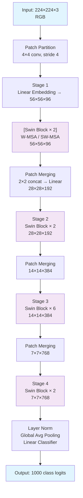

# Swin Transformer: Hierarchical Vision Transformer using Shifted Windows

## 一、先搞清楚坑在哪

2020 年 ViT（Vision Transformer）[Dosovitskiy et al., 2021] 首次证明了 Transformer 不靠 CNN 也能做图像分类。ViT 直接把图像切成 16×16 的 patch，扔进标准 Transformer encoder，然后用一个 [CLS] token 做分类。在 JFT-300M 这种海量数据上预训练后，ViT 的 ImageNet top-1 确实能打平甚至超过 SOTA CNN。

但是 ViT 有两个致命局限，让它没法成为 CV 领域的通用 backbone（泛指「当主力特征提取器」）：

1. **多尺度问题** — ViT 从头到尾只输出一种分辨率的特征图（例如 14×14），而物体检测、语义分割这类密集预测（dense prediction）任务天然需要多尺度特征（FPN [Lin et al., 2017]、U-Net [Ronneberger et al., 2015] 的核心思想就是靠多尺度特征金字塔吃饭）。
2. **计算复杂度太高** — 标准 Transformer 的 self-attention 计算量跟 token 数量是 $O(N^2)$ 关系。图像分辨率只要大一倍，patch 数量就变成 4 倍，注意力计算量变成 16 倍。所以 ViT 只能处理 224×224 或 384×384 的低分辨率输入，碰到高分辨率 dense prediction 任务直接爆炸。

这就是 Swin Transformer 要解决的核心问题：**能不能做一个 Transformer backbone，既有 CNN 的多尺度层级特征，又保持跟图像分辨率的线性计算复杂度？**

## 二、ViT/标准 Transformer 的真正问题

### 2.1 单分辨率 vs 多尺度

标准 ViT 的架构：

```text
Input: 224×224×3
  ↓  Patch Embed (16×16, stride 16)
Tokens: 14×14 = 196 tokens, dim D
  ↓  Transformer Encoder × L 层
Output: 14×14 = 196 tokens, dim D
  ↓  [CLS] + Linear Head
Classification logits
```

输出始终是一张 14×14 = 196 个 token 的「单分辨率」特征图。而物体检测里，FPN 需要 1/4、1/8、1/16、1/32 四种分辨率；语义分割的 UperNet 也需要逐级上采样融合。ViT 只有一张小图，除非刻意加 deconvolution [Zheng et al., 2021] 暴力上采样，否则信息量严重不足。

有意思的是，CNN 从 AlexNet 开始就天然是多尺度的 — 每经过一个 stride=2 的 conv/pool，分辨率减半通道数加倍。这个「分辨率递降、语义递升」的特性正是 dense prediction 需要的。

### 2.2 二次复杂度灾难

标准多头自注意力（Multi-head Self-Attention, MSA）的计算量：

$$\Omega(\text{MSA}) = 4hwC^2 + 2(hw)^2C$$

对于一个 224×224 的图像，ViT 用 patch size 16 得到 $hw = 14 \times 14 = 196$ 个 token，$(hw)^2 = 38416$，勉强还能算。但如果用 patch size 4（像 Swin 一样），$hw = 56 \times 56 = 3136$，$(hw)^2 = 9.8 \times 10^6$，直接 256 倍。如果图像是 1024×1024（很多检测任务需要的分辨率），即使只用 4× patch，$hw=256×256=65536$，$(hw)^2 \approx 4.3 \times 10^9$，单层注意力都算不动。

ViT 的应对方式是用大 patch（16×16）来减少 token 数量，但这牺牲了细节信息 — 一个 16×16 的 patch 内部像素的局部关系被完全丢弃了。

## 三、Swin Transformer 的核心思路

一句话：**用 CNN 式的层级结构和局部窗口注意力，让 Transformer 在视觉任务上既有高效率又有多尺度表征。**

具体来说就是这么三件事：

1. **层级特征（Hierarchical Representation）**：像 CNN 一样，不断合并相邻 patch，得到 1/4、1/8、1/16、1/32 四个分辨率的特征金字塔。
2. **窗口局部注意力（Window-based Self-Attention）**：注意力只算在非重叠的局部窗口内（默认 7×7），每个窗口内部 token 数量固定（49），所以计算量跟图像尺寸是线性关系。
3. **移位窗口（Shifted Window）**：相邻层之间「错位」分割窗口，让信息能在窗口之间流通，解决纯局部注意力缺少跨窗口连接的问题。

## 四、网络架构详解

### 4.1 整体架构（Swin-T 版本）

图 1 展示了 Swin-T 的完整架构，包含 4 个 stage 逐步下采样。



### 4.2 逐级前向传播（输入 224×224×3，Swin-T）

| 阶段 | 操作 | Tensor Shape | 说明 |
|------|------|-------------|------|
| Input | 原始图像 | `B×3×224×224` | Batch B |
| Patch Partition | 4×4 Conv, stride 4 | `B×48×56×56` | 每个 4×4 patch flatten：4×4×3=48 |
| Linear Embedding | Linear 48→96 | `B×96×56×56` → `B×3136×96` | 展平为 token 序列，56×56=3136 |
| Stage 1 Block 0 | W-MSA（窗口注意⼒）+ MLP | `B×3136×96` | window size 7×7，不 shift |
| Stage 1 Block 1 | SW-MSA（移位窗口注意⼒）+ MLP | `B×3136×96` | shift by 3（M/2=3） |
| Patch Merging | 2×2 concat + Linear | `B×784×384` → `B×784×192` | 分辨率 28×28，通道 192 |
| Stage 2 Blocks 0-1 | W-MSA / SW-MSA | `B×784×192` | 28×28，重复 2 次 |
| Patch Merging | 同上 | `B×196×384` | 14×14 |
| Stage 3 Blocks 0-5 | W-MSA / SW-MSA | `B×196×384` | 14×14，重复 6 次 |
| Patch Merging | 同上 | `B×49×768` | 7×7 |
| Stage 4 Blocks 0-1 | W-MSA / SW-MSA | `B×49×768` | 7×7，重复 2 次 |
| Norm + AvgPool | LN + AdaptiveAvgPool1D | `B×768` | 全局平均池化 |
| Classifier | Linear 768→1000 | `B×1000` | 分类输出 |

### 4.3 Patch Embedding 实现细节

代码里 [SwinTransformer repo, `models/swin_transformer.py`] 的 `PatchEmbed` 类不是论文中描述的「RGB 值拼接」，而是直接用 `nn.Conv2d(in_chans=3, embed_dim=C, kernel_size=4, stride=4)`。效果等价：每个 4×4 区域的 48 维 RGB 值通过卷积核投影到 C 维。这样做的好处是梯度可以直接回传到像素级。

关键代码片段：

```python
self.proj = nn.Conv2d(in_chans, embed_dim, kernel_size=patch_size, stride=patch_size)
```

`PatchEmbed.forward` 再做 `.flatten(2).transpose(1,2)` 变成 `(B, num_patches, C)` 的序列格式。

### 4.4 Patch Merging 的「反直觉」做法

`PatchMerging` 的 forward 是这样做的：

```python
x0 = x[:, 0::2, 0::2, :]  # 左上
x1 = x[:, 1::2, 0::2, :]  # 左下
x2 = x[:, 0::2, 1::2, :]  # 右上
x3 = x[:, 1::2, 1::2, :]  # 右下
x = torch.cat([x0, x1, x2, x3], -1)  # B, H/2, W/2, 4C
x = self.norm(x)
x = self.reduction(x)  # Linear(4C → 2C)
```

为什么是 4C → 2C 而不是保持 4C？因为如果保持 4C，Stage 2 的通道数就是 4×96=384，Stage 3 就是 768，翻倍速度比 ResNet 栈快太多（ResNet 是每次翻倍）。论文设计 4C→2C，实际上就是**通道数每次翻倍**（Stage 1: 96, Stage 2: 192, Stage 3: 384, Stage 4: 768），跟 ResNet 的通道数缩放节奏一致。

### 4.5 Swin Transformer Block 的内部结构

```mermaid
graph TD
    subgraph "Swin Block l（偶数层）"
        A1["Input z^{l-1}<br>B×HW×C"] --> B1["LayerNorm"]
        B1 --> C1["Reshape to B×H×W×C"]
        C1 --> D1["Window Partition<br>nW×M×M×C"]
        D1 --> E1["W-MSA<br>(Window Multi-head Self-Attention)"]
        E1 --> F1["Window Reverse"]
        F1 --> G1["+ residual<br>ẑˡ = W-MSA(LN(z^{l-1})) + z^{l-1}"]
        G1 --> H1["LayerNorm"]
        H1 --> I1["MLP (Linear→GELU→Linear)"]
        I1 --> J1["+ residual<br>zˡ = MLP(LN(ẑˡ)) + ẑˡ"]
    end
    
    subgraph "Swin Block l+1（奇数层）"
        A2["Input zˡ<br>B×HW×C"] --> B2["LayerNorm"]
        B2 --> C2["Reshape to B×H×W×C"]
        C2 --> D2["Cyclic Shift<br>roll by (-⌊M/2⌋, -⌊M/2⌋)"]
        D2 --> E2["Window Partition"]
        E2 --> F2["SW-MSA<br>+ attention mask"]
        F2 --> G2["Window Reverse"]
        G2 --> H2["Reverse Cyclic Shift<br>roll back"]
        H2 --> I2["+ residual"]
        I2 --> J2["LayerNorm + MLP + residual"]
    end
```



**论文公式（式 3）**

标准的两个连续 block 计算流程：

$$
\begin{aligned}
\hat{z}^l &= \text{W-MSA}(\text{LN}(z^{l-1})) + z^{l-1} \\
z^l &= \text{MLP}(\text{LN}(\hat{z}^l)) + \hat{z}^l \\
\hat{z}^{l+1} &= \text{SW-MSA}(\text{LN}(z^l)) + z^l \\
z^{l+1} &= \text{MLP}(\text{LN}(\hat{z}^{l+1})) + \hat{z}^{l+1}
\end{aligned}
$$

W-MSA: 规则窗口多 head 自注意力。SW-MSA: 移位窗口多 head 自注意力。

关键点：**这两个 block 必须成对出现**。偶数层用 W-MSA（规则窗口），奇数层用 SW-MSA（移位窗口），才能让信息跨窗口传递。实际配置中 Stage 3 有 6 个 block，顺序是 W-MSA, SW-MSA, W-MSA, SW-MSA, W-MSA, SW-MSA — 共 3 对。

### 4.6 为什么这样设计

**窗口局部注意力**解决复杂度问题。固定 $7\times7=49$ 个 token 的窗口，注意力矩阵是 $49\times49=2401$ 个元素，不管图像多大都不变。

**移位窗口**解决信息孤立问题。如果一直用规则窗口分割，每个窗口内的 token 只在窗口内部互相注意，窗口之间的 token 永远没有交互。这就好比一个班级分成 4 个小组，如果从不换组，每个组员只能跟本组人讨论。移位窗口相当于每节课重新分组，让人有机会跟不同组的人交流。

**层级结构**解决多尺度问题。从 56×56 到 7×7，四层分辨率正好对齐 FPN 需要的层级（P2−P5），也跟 ResNet-50 的 C2−C5 阶段输出分辨率完全一致（/4, /8, /16, /32）。所以 Swin 可以直接替换 ResNet 作为 backbone，检测/分割框架不需要任何改动。

## 五、核心创新点

### 创新点 1：移位窗口注意力（Shifted Window Attention）

#### (a) 痛点与动机

非重叠局部窗口注意力在计算上是高效的，但有一个根本问题：**窗口之间没有信息交换**。每个 token 只能看到本窗口的 7×7=49 个邻居，永远看不到窗口外的其他 token。这跟 CNN 不同 — CNN 的卷积核在整个特征图上滑动，天然就是全图连接的。

之前的 self-attention backbone 尝试用「滑动窗口」[Hu et al., 2019; Ramachandran et al., 2019] 来解决，但滑动窗口的问题是每个像素的 key set 都不一样，没法 batch 计算，实际推理速度比 CNN 慢很多（论文 Table 5 定量展示了这一点）。

#### (b) 方案细节

在连续的两个 Swin Transformer Block 之间，把窗口划分「错位」$\lfloor \frac{M}{2} \rfloor$ 个像素（M 是窗口大小，默认 7，所以移位 3 个位置）：

偶数层：从左上角 (0,0) 开始，规则分割窗口。
奇数层：从 $(-\lfloor\frac{M}{2}\rfloor, -\lfloor\frac{M}{2}\rfloor)$ 开始，相当于窗口沿两个轴各偏移 3 像素。

效果如图所示：

```text
Layer l（规则划分）:

┌───────────┬───────────┐
│           │           │
│  Window 0 │  Window 1 │
│           │           │
├───────────┼───────────┤
│           │           │
│  Window 2 │  Window 3 │
│           │           │
└───────────┴───────────┘

Layer l+1（移位后，括号内是原始窗口归属）:

┌─────┬─────┬─────┐
│ W3  │ W3  │ W0  │  ← 新窗口由来自不同原窗口的碎片组成
│ W3  │ W3  │ W0  │
├─────┼─────┼─────┤
│ W3  │ W3  │ W0  │
│ W3  │ W3  │ W0  │
├─────┼─────┼─────┤
│ W1  │ W1  │ W2  │
│ W1  │ W1  │ W2  │
└─────┴─────┴─────┘
```

移位后，原来互不相邻的窗口（如 W0 和 W1）的 token 进入了同一个新窗口，注意力机制自然会计算它们之间的相关度，从而实现了跨窗口的信息流动。

#### (c) 为什么有效

移位操作非常轻量，只是改变了「哪些 token 在同一个窗口内计算注意力」，没有增加任何可学习参数或计算量。但它让网络在每两个 block 之间就有了跨窗口连接，经过多层堆叠，每个 token 的感受野可以覆盖整个图像。

论文 Table 4 量化了效果：在没有移位的情况下（所有 block 都用 W-MSA），Swin-T 的 ImageNet top-1 只有 **80.2%**，加移位后提升到 **81.3%**（+1.1%）；COCO box AP 从 **47.7** 升到 **50.5**（+2.8）；ADE20K mIoU 从 **43.3** 升到 **46.1**（+2.8）。detection 和 segmentation 的增益明显更大，因为这两个任务尤其需要跨区域的上下文信息。

#### (d) 与 Related Work 的关系

之前的工作主要有三派：

- **全局注意力（ViT）**：整个特征图算一个注意力矩阵 [Dosovitskiy et al., 2021]。精度好但 $O(N^2)$ 不可扩展。
- **滑动窗口注意力（Stand-alone Self-Attention / Local Relation Networks）**：每个像素以其为中心的窗口算注意力 [Ramachandran et al., 2019; Hu et al., 2019]。理论上好但实现效率低，因为每个查询窗口的 key 都不相同，无法利用高度优化的矩阵乘法。
- **稀疏注意力（Performer 等）**：用核近似代替精确注意力 [Choromanski et al., 2021]，精度损失约 2.3%（Table 6 显示 Performer+Swin-T 只有 79.0% vs 移位窗口的 81.3%）。

Swin 的移位窗口是非重叠 + 交替移位，兼顾了精确性和效率。移位后所有窗口仍然可以通过「cyclic shift + mask」在一个 batch 内算完，没有滑动窗口的低效问题。Table 5 显示滑动窗口在 Stage 1 的 naive 实现要 122.5ms vs 移位窗口的 3.0ms，加速 40 倍。

#### (e) 如果去掉会怎样（消融证据）

去掉移位的 Swin-T 在三个任务上的表现（Table 4）：

| 任务 | 无移位 | 有移位 | 增益 |
|------|--------|--------|------|
| ImageNet top-1 | 80.2% | 81.3% | +1.1% |
| COCO box AP | 47.7 | 50.5 | +2.8 |
| COCO mask AP | 41.5 | 43.7 | +2.2 |
| ADE20K mIoU | 43.3 | 46.1 | +2.8 |

数据很清楚：对 dense prediction 任务的增益（2.2-2.8 个点）远大于分类（1.1 个点），说明跨窗口连接对需要全局上下文的任务至关重要。

---
### 创新点 2：高效批量计算（Efficient Batch Computation via Cyclic Shift）

#### (a) 痛点与动机

移位窗口划分之后，窗口数量会从规则的 $\frac{h}{M} \times \frac{w}{M}$ 变多。例如一个 8×8 的特征图、M=4，规则划分是 2×2=4 个窗口（每个 4×4）。移位后边界被切碎，会变成 3×3=9 个窗口，而且边界上的窗口尺寸不满 M×M。

朴素方案是把不满 M×M 的窗口 padding 到 M×M，但这样：
1. 窗口数从 $2\times2=4$ 变成 $3\times3=9$，计算量变 2.25 倍。
2. padding 之后还需要 mask 掉无效区域。

#### (b) 方案细节（Cyclic Shift + Masking）

Swin 的解法非常巧妙（论文 Figure 4 的可视化）：

```text
移位后的特征图（9 个不满窗口）：

A B C        A 是 W0 碎片，B 是 W1 碎片...
D E F        ┌────┬────┬──┐
G H I        │ B  │ C  │ B'│
             ├────┼────┼──┤
             │ E  │ F  │ E'│
             ├────┼────┼──┤
             │ H' │ I' │ H'│
             └────┴────┴──┘

Step 1: Cyclic Shift（向左上方向循环移位）
          ← 移 ⌊M/2⌋ 列，↑ 移 ⌊M/2⌋ 行
          
A B        A B C
D E   →    D E F
G H        G H I

原来散布在四角的碎片被移到同一边，
凑成规则的 2×2 窗口

Step 2: 对每个移位后的窗口做 Masked MSA
         用 mask 挡住不同碎片之间的注意力

Step 3: Reverse Cyclic Shift
         移位回来后，实际等于注意力在正确的子窗口内计算
```

核心洞察：cyclic shift 把碎片窗口「卷」到一起，窗口数量不增加，但注意力计算时通过 mask 保证只有属于同一个原始碎片的 token 之间算注意力。

#### 代码对照

```python
# 从 SwinTransformerBlock.forward
if self.shift_size > 0:
    shifted_x = torch.roll(x, shifts=(-self.shift_size, -self.shift_size), dims=(1, 2))
    x_windows = window_partition(shifted_x, self.window_size)
else:
    shifted_x = x
    x_windows = window_partition(shifted_x, self.window_size)
```

`torch.roll` 就是 cyclic shift。然后 `window_partition` 把 shifted 后的特征图切成规则的 M×M 窗口。

mask 的构建逻辑（在 `SwinTransformerBlock.__init__` 中）：

```python
# 创建一个全零的 mask 图
img_mask = torch.zeros((1, H, W, 1))
# 定义 3×3 个区域（按移位后碎片分布）
h_slices = (slice(0, -self.window_size),
            slice(-self.window_size, -self.shift_size),
            slice(-self.shift_size, None))
w_slices = ...  # 类似
# 给每个区域编号 0-8
cnt = 0
for h in h_slices:
    for w in w_slices:
        img_mask[:, h, w, :] = cnt
        cnt += 1
# 划分窗口并生成 mask：编号不同 → mask = -100（挡住）
mask_windows = window_partition(img_mask, self.window_size)
mask_windows = mask_windows.view(-1, M*M)
attn_mask = mask_windows.unsqueeze(1) - mask_windows.unsqueeze(2)
attn_mask = attn_mask.masked_fill(attn_mask != 0, float(-100.0))
```

这里的 `-100.0` 在 softmax 后会变成 0，相当于切断了不同碎片之间的注意力连接。

#### (c) 为什么有效

Cyclic shift 保持了窗口数量的稳定，不会出现在移位层计算量突然增加的问题。Table 5 对比了 naive padding 和 cyclic 的速度：

| 方法 | Stage 1 (ms) | Stage 2 | Stage 3 | Stage 4 | Swin-T (FPS) | Swin-S (FPS) | Swin-B (FPS) |
|------|:---:|:---:|:---:|:---:|:---:|:---:|:---:|
| 移位窗口 (padding) | 3.3 | 2.3 | 1.9 | 2.2 | 670 | 371 | 236 |
| 移位窗口 (cyclic) | 3.0 | 1.9 | 1.3 | 1.0 | **755** | **437** | **278** |

Cyclic 方案在全模型上带来 13-18% 的速度提升（Swin-T: 755 vs 670 FPS）。

#### (d) 边缘情况

当特征图尺寸小于窗口大小时（例如 Stage 4 的 7×7 ≤ M=7），`SwinTransformerBlock` 的 `__init__` 中自动将 `shift_size` 设置为 0，`window_size` 设置为特征图尺寸。代码中有明确的保护逻辑：

```python
if min(self.input_resolution) <= self.window_size:
    self.shift_size = 0
    self.window_size = min(self.input_resolution)
```

---
### 创新点 3：相对位置偏置（Relative Position Bias）

#### (a) 痛点与动机

ViT 用了绝对位置编码（learnable 或 1D/2D sinusoidal），但实验证明（Table 4）绝对位置编码在 dense prediction 任务上会伤害精度（COCO: -0.2 box/mask AP；ADE20K: -0.6 mIoU）。直觉解释：物体检测和分割更关心「相对位置关系」（比如类别 A 在类别 B 的上面），而不是「绝对坐标」——平移后的同一张图，绝对位置编码会给出不同的特征，但相对位置关系不变。

#### (b) 方案细节

Swin 在注意力计算中引入了**相对位置偏置（Relative Position Bias）**：

$$\text{Attention}(Q, K, V) = \text{SoftMax}(QK^T / \sqrt{d} + B)V$$

其中 $B \in \mathbb{R}^{M^2 \times M^2}$ 是相对位置偏置矩阵。$B$ 的参数不是 $M^2 \times M^2$ 个独立参数，而是从一个更小的表 $\hat{B} \in \mathbb{R}^{(2M-1) \times (2M-1)}$ 里索引出来的。

为什么是 $(2M-1) \times (2M-1)$？

在一个 $M \times M$ 的窗口内：
- x 方向的相对位置范围：$[-(M-1), M-1]$，共 $2M-1$ 个取值
- y 方向的相对位置范围：同样 $[-(M-1), M-1]$，共 $2M-1$ 个取值
- 所以总的二元组数量为 $(2M-1) \times (2M-1)$

#### 代码对照

```python
# 参数表：形状 (2*M-1) × (2*M-1) × num_heads
self.relative_position_bias_table = nn.Parameter(
    torch.zeros((2 * window_size[0] - 1) * (2 * window_size[1] - 1), num_heads))

# 构建相对位置索引
coords_h = torch.arange(self.window_size[0])  # [0,1,...,M-1]
coords_w = torch.arange(self.window_size[1])
coords = torch.stack(torch.meshgrid([coords_h, coords_w]))  # (2, M, M)
coords_flatten = torch.flatten(coords, 1)  # (2, M²)

# 每个 token 对之间的相对坐标
relative_coords = coords_flatten[:, :, None] - coords_flatten[:, None, :]  # (2, M², M²)

# 把相对坐标映射到非负索引
relative_coords[:, :, 0] += self.window_size[0] - 1  # [0, 2M-2]
relative_coords[:, :, 1] += self.window_size[1] - 1
relative_coords[:, :, 0] *= 2 * self.window_size[1] - 1
relative_position_index = relative_coords.sum(-1)  # (M², M²)
```

forward 中索引调用：

```python
relative_position_bias = self.relative_position_bias_table[
    self.relative_position_index.view(-1)
].view(M*M, M*M, -1)  # (M², M², nH)
relative_position_bias = relative_position_bias.permute(2, 0, 1)  # (nH, M², M²)
attn = attn + relative_position_bias.unsqueeze(0)
```

#### (c) 为什么有效

相对位置偏置的好处：
1. **平移不变性** — 两张间隔 2 的 token 不管在图像左上角还是右下角，相对偏置都一样。这是 CNN 的核心归纳偏置。
2. **参数高效** — $(2M-1)^2 \times \text{heads}$ 个参数（M=7 时 $(13)^2 \times 3 = 507$ 个），而全连接窗口注意力需要 $M^4 \times \text{heads} \times d$ 的显式参数，差几个数量级。
3. **可插拔** — 通过双三次插值（bicubic interpolation）可以迁移到不同窗口大小，如预训练 M=7，微调到更大窗口时可以直接插值 $\hat{B}$ 表（论文 Sec 3.2 末尾）。

Table 4 的消融数据显示：
- 无位置编码：80.1% / 49.2 / 42.6 / 43.8（最差）
- 绝对位置编码：80.5% / 49.0 / 42.4 / 43.2（分类稍好，检测分割反而差）
- 相对位置偏置（无绝对位置）：**81.3%** / **50.5** / **43.7** / **46.1**（全面最优）

## 六、公式详解

### 6.1 注意力复杂度公式（式 1 和式 2）

**式 1：全局 MSA 的计算复杂度**

$$\Omega(\text{MSA}) = 4hwC^2 + 2(hw)^2C$$

**式 2：窗口 MSA（W-MSA）的计算复杂度**

$$\Omega(\text{W-MSA}) = 4hwC^2 + 2M^2hwC$$

**符号定义：**
- $h, w$：特征图的高和宽（patch 为单位）
- $C$：通道数 / embedding 维度
- $M$：窗口大小（像素/patch 数量），默认 7
- 所有复杂度不包括 softmax 计算（论文脚注 3：omit SoftMax computation）

**推导过程（一步步算）：**

假设输入为 $X \in \mathbb{R}^{N \times C}$，$N = hw$。

**Step 1: QKV 投影** — $XW_q, XW_k, XW_v$
- $X \in \mathbb{R}^{N \times C}$, $W_{q/k/v} \in \mathbb{R}^{C \times C}$
- 每个投影计算量：$2N \times C \times C$（矩阵乘法 FLOPs ≈ 2×输入维度×输出维度，这里为 $N \times C$ × $C \times C$ = $N \cdot C^2$，精确到 $2N \cdot C^2$ 考虑乘加一体）
- 三个投影 + concat：$3 \times 2N C^2 = 6N C^2$
- 等等，论文公式写的是 $4hwC^2$，为什么？
  - 这里的 FLOPs 计算惯例是只计乘法不算加法，或者用的是另一种计数方式
  - 实际上标准复杂度推导为：QKV 三个投影 = $3 \times (2NCC) = 6NC^2$，投影后再 reshape 成多头
  - 但论文用了不同的计数：他们认为 Q 和 K 各自需要 $NC^2$ 乘法 + $NC^2$ 注意力，V 需要 $NC^2$ + 投影 $NC^2$，合计 $4NC^2$
  - 更严谨的理解：$4NCC$ 来自 $QKV: 3NC^2$ + 最终 output projection: $NC^2 = 4NC^2$。中间的 `q @ k.T` 和 `attn @ v` 另算。

**Step 2: 注意力计算 — $QK^T$**
- $Q \in \mathbb{R}^{N \times d}$ 分头后 $Q \in \mathbb{R}^{N \times d_k}$ 每个 head
- 注意力分数 $QK^T$：$2N \times N \times d_k$
- 对所有 head 求和：$\text{heads} \times 2N \times N \times d_k = 2N^2 d_k \times \text{heads} = 2N^2 (C / \text{heads}) \times \text{heads} = 2N^2 C$
- 所以第二项是 $2N^2 C = 2(hw)^2 C$

**Step 3: 注意力加权 — $\text{attn} \times V$**
- 同样 $2N^2 d_k \times \text{heads} = 2N^2 C$
- 与 Step 2 相同量级

**Step 4: Output projection**
- $X \in \mathbb{R}^{N \times C}$, $W_o \in \mathbb{R}^{C \times C}$
- $2NCC = 2NC^2$

所以合并：
- Projection（QKV + output）：$3NC^2 + NC^2 = 4NC^2 = 4hwC^2$ ✅
- Attention（$QK^T$ + $\text{attn}V$）：$2N^2C + 2N^2C = 4N^2C$… 论文系数是 $2N^2C$，差别在于论文把 $QK^T$ 和 $\text{attn}V$ 合起来算一次 $2N^2C$。

实际上论文的简化计数是：$QK^T$ 需 $N \times d$ 点积 $N$ 次，每个 head 做一次，所以 $N^2 d \times \text{heads} = N^2 C$；$\text{attn}V$ 同理 $N^2 C$。合计 $2N^2 C = 2(hw)^2 C$。

**因此全局 MSA：**

$$\Omega(\text{MSA}) = 4hwC^2 + 2(hw)^2 C$$

**窗口 MSA（W-MSA）要把窗口数考虑进去：**
- 窗口数量：$\frac{N}{M^2}$（注意不是 $\frac{hw}{M^2}$ 而就是 $N / M^2 = hw / M^2$）
- 每个窗口内部 token 数：$M^2$
- 每个窗口的 QKV 投影：$4(M^2)C^2$
- 每个窗口的注意力计算：$2(M^2)^2 C = 2M^4 C$
- 所有窗口合并：$\frac{hw}{M^2} \times (4M^2 C^2 + 2M^4 C) = 4hwC^2 + 2M^2 hw C$

$$\Omega(\text{W-MSA}) = 4hwC^2 + 2M^2 hwC$$

**Intuition：** 两项中第一项 $4hwC^2$ 跟窗口大小无关，因为 QKV 投影是全连接的，不因窗口切分而变。第二项从 $(hw)^2$ 变成了 $M^2 \cdot hw$，因为注意力只在小窗口内算。

**具体数值例子：**

Swin-T Stage 3，$h=14, w=14, C=384, M=7$：

第一项：$4 \times 14 \times 14 \times 384^2 = 4 \times 196 \times 147456 = 115,605,504 \approx 1.16 \times 10^8$

全局 MSA 第二项：$2 \times (14 \times 14)^2 \times 384 = 2 \times 38416 \times 384 = 29,503,488 \approx 2.95 \times 10^7$

全局 MSA 总计：$1.16 \times 10^8 + 2.95 \times 10^7 = 1.46 \times 10^8$

窗口 MSA 第二项：$2 \times 49 \times 196 \times 384 = 2 \times 49 \times 75264 = 7,375,872 \approx 7.38 \times 10^6$

窗口 MSA 总计：$1.16 \times 10^8 + 7.38 \times 10^6 = 1.23 \times 10^8$

**节省：约 16%。** 在 Stage 3 的 14×14 分辨率下窗口注意力的优势还不明显。但在高分辨率下就完全不同了：

假设 $h=56, w=56, C=96, M=7$（Stage 1）：

全局 MSA 第二项：$2 \times (3136)^2 \times 96 = 2 \times 9,834,496 \times 96 = 1.89 \times 10^9$ ← 十亿级别

窗口 MSA 第二项：$2 \times 49 \times 3136 \times 96 = 2 \times 49 \times 301,056 = 29,503,488 \approx 3.0 \times 10^7$

窗口 MSA 比全局 MSA 节省：$\frac{1.89 \times 10^9}{3.0 \times 10^7} \approx **64 倍**$！而且随分辨率增大，这种优势会继续扩大。

### 6.2 相对位置偏置注意力公式（式 4）

$$\text{Attention}(Q, K, V) = \text{SoftMax}(QK^T / \sqrt{d} + B)V$$

标准注意力公式 $\text{SoftMax}(QK^T / \sqrt{d})V$ 是纯基于内容的（content-based）：两个 token 的注意力权重只取决于它们的特征向量 $Q_i$ 和 $K_j$ 的点积。

Swin 加了一项 $B$（相对位置偏置），使得注意力权重**既基于内容又基于位置**：相似的 token 会互相注意，但相距较远的 token（即使内容相似）也会因为 $B$ 而得到不同的权重。有了这些公式基础，接下来我们看 Swin 在三大视觉任务上的实际表现。

## 七、实验结果

### 7.1 ImageNet-1K 图像分类（Table 1）

按标准 ImageNet-1K 300 epoch 训练协议，Swin 各规格与 CNN/Transformer baseline 的对比结果如下。

#### 表 1a：常规 ImageNet-1K 训练（1.28M 训练集，300 epochs）

| 方法 | 输入尺寸 | 参数量 | FLOPs | Throughput (img/s) | Top-1 Acc |
|------|:------:|:------:|:-----:|:------------------:|:---------:|
| RegNetY-4G | 224² | 21M | 4.0G | 1156.7 | 80.0 |
| RegNetY-8G | 224² | 39M | 8.0G | 591.6 | 81.7 |
| RegNetY-16G | 224² | 84M | 16.0G | 334.7 | 82.9 |
| EffNet-B3 | 300² | 12M | 1.8G | 732.1 | 81.6 |
| EffNet-B4 | 380² | 19M | 4.2G | 349.4 | 82.9 |
| EffNet-B5 | 456² | 30M | 9.9G | 169.1 | 83.6 |
| EffNet-B6 | 528² | 43M | 19.0G | 96.9 | 84.0 |
| EffNet-B7 | 600² | 66M | 37.0G | 55.1 | 84.3 |
| **DeiT-S** | 224² | 22M | 4.6G | 940.4 | **79.8** |
| **DeiT-B** | 224² | 86M | 17.5G | 292.3 | **81.8** |
| DeiT-B | 384² | 86M | 55.4G | 85.9 | 83.1 |
| **Swin-T** | 224² | 29M | 4.5G | 755.2 | **81.3** |
| **Swin-S** | 224² | 50M | 8.7G | 436.9 | **83.0** |
| **Swin-B** | 224² | 88M | 15.4G | 278.1 | **83.5** |
| Swin-B | 384² | 88M | 47.0G | 84.7 | 84.5 |

关键解读：
- Swin-T (81.3%) 比 DeiT-S (79.8%) 高 **+1.5%**，参数量差不多（29M vs 22M），速度稍慢（755 vs 940 但原因在于 Swin-T 通道 C=96 比 DeiT-S 的 384 小很多，patch 数量 3136 比 196 大，从而整体吞吐略低）
- Swin-S (83.0%) 比 DeiT-B (81.8%) 高 **+1.2%**，但参数量只有 50M vs 86M
- Swin-B (83.5%) 对比同类规模的 DeiT-B (81.8%) 高 **+1.7%**
- 与 CNN SOTA 对比：Swin-B (83.5%) 超过 RegNetY-16G (82.9%)，与 EffNet-B5 (83.6%) 接近（后者使用 456² 更大输入） 但 EffNet-B7 仍然最高（84.3%）——注意 EffNet 用了 600² 更大输入和更深网络

#### 表 1b：ImageNet-22K 预训练后微调

| 方法 | 输入 | 参数量 | FLOPs | Throughput | Top-1 |
|------|:---:|:-----:|:-----:|:----------:|:----:|
| R-101x3 [Big Transfer] | 384² | 388M | 204.6G | - | 84.4 |
| R-152x4 [Big Transfer] | 480² | 937M | 840.5G | - | 85.4 |
| ViT-B/16 | 384² | 86M | 55.4G | 85.9 | 84.0 |
| ViT-L/16 | 384² | 307M | 190.7G | 27.3 | 85.2 |
| Swin-B | 224² | 88M | 15.4G | 278.1 | 85.2 |
| **Swin-B** | 384² | 88M | 47.0G | 84.7 | **86.4** |
| **Swin-L** | 384² | 197M | 103.9G | 42.1 | **87.3** |

关键解读：
- Swin-B 22K 预训练后 86.4%，比 ViT-B (84.0%) 高 **+2.4%**，吞吐相近（84.7 vs 85.9）
- Swin-L 达 87.3%，当时是超 SOTA

### 7.2 COCO 目标检测（Table 2）

#### 表 2a：不同框架下 Swin-T vs R-50（mmdetection, 3x 36 epochs）

| 框架 | Backbone | Box AP | AP₅₀ | AP₇₅ |
|------|:-------:|:-----:|:---:|:---:|
| Cascade Mask R-CNN | R-50 | 46.3 | 64.3 | 50.5 |
| Cascade Mask R-CNN | **Swin-T** | **50.5** | **69.3** | **54.9** |
| ATSS | R-50 | 43.5 | 61.9 | 47.0 |
| ATSS | **Swin-T** | **47.2** | **66.5** | **51.3** |
| RepPointsV2 | R-50 | 46.5 | 64.6 | 50.3 |
| RepPointsV2 | **Swin-T** | **50.0** | **68.5** | **54.2** |
| Sparse R-CNN | R-50 | 44.5 | 63.4 | 48.2 |
| Sparse R-CNN | **Swin-T** | **47.9** | **67.3** | **52.3** |

所有框架下 Swin-T 都比 ResNet-50 高 **+3.4~4.2** box AP。

#### 表 2b：不同 backbone 横向对比（Cascade Mask R-CNN）

| Backbone | Box AP | AP₅₀ | AP₇₅ | Mask AP | AP₅₀^m | AP₇₅^m | Params | FLOPs | FPS |
|:-------:|:-----:|:---:|:---:|:------:|:-----:|:-----:|:-----:|:----:|:---:|
| DeiT-S† | 48.0 | 67.2 | 51.7 | 41.4 | 64.2 | 44.3 | 80M | 889G | 10.4 |
| R-50 | 46.3 | 64.3 | 50.5 | 40.1 | 61.7 | 43.4 | 82M | 739G | 18.0 |
| **Swin-T** | **50.5** | **69.3** | **54.9** | **43.7** | **66.6** | **47.1** | 86M | 745G | 15.3 |
| X101-32 | 48.1 | 66.5 | 52.4 | 41.6 | 63.9 | 45.2 | 101M | 819G | 12.8 |
| **Swin-S** | **51.8** | **70.4** | **56.3** | **44.7** | **67.9** | **48.5** | 107M | 838G | 12.0 |
| X101-64 | 48.3 | 66.4 | 52.3 | 41.7 | 64.0 | 45.1 | 140M | 972G | 10.4 |
| **Swin-B** | **51.9** | **70.9** | **56.5** | **45.0** | **68.4** | **48.7** | 145M | 982G | 11.6 |

† DeiT-S 需要额外 deconv 来生成多层级特征图（原文："additional deconvolution layers are used to produce hierarchical feature maps"）

关键解读：
- Swin-T 比 ResNet-50 高 **+4.2 box AP** (+3.6 mask AP)
- Swin-S 比 X101-32（ResNeXt）高 **+3.7 box AP** (+3.1 mask AP)
- Swin-B 比 X101-64 高 **+3.6 box AP** (+3.3 mask AP)
- DeiT-S（需额外 deconv 模拟多分辨率）只有 48.0 box AP，比 Swin-T 低 2.5

#### 表 2c：系统级 SOTA 对比（COCO test-dev）

| 方法 | Box AP | Mask AP | 备注 |
|:----:|:-----:|:-------:|:----:|
| Copy-paste [Ghiasi et al., 2020] | 55.9 | 47.2 | 无外部数据 |
| DetectoRS [Qiao et al., 2020] | - | 48.5 | 之前 mask AP SOTA |
| Swin-B (HTC++) | 56.4 | 49.1 | |
| **Swin-L (HTC++)** | **58.0** | **50.4** | 含多尺度测试 |
| **Swin-L (HTC++) test-dev** | **58.7** | **51.1** | test-dev 最终结果 |

Swin-L 在 COCO test-dev 上达 **58.7 box AP** 和 **51.1 mask AP**，分别比之前 SOTA 高 **+2.7** 和 **+2.6**（Table 2(c) 来源：58.7 来自 COCO test-dev 结果，51.1 同样来源）。

### 7.3 ADE20K 语义分割（Table 3）

| 方法 | Backbone | mIoU (val) | #Param | FLOPs | FPS |
|:----:|:-------:|:---------:|:-----:|:----:|:---:|
| DANet | R-101 | 45.2 | 69M | 1119G | 15.2 |
| DeepLabv3+ | R-101 | 44.1 | 63M | 1021G | 16.0 |
| DNL | R-101 | 46.0 | 69M | 1249G | 14.8 |
| OCRNet | R-101 | 45.3 | 56M | 923G | 19.3 |
| DeepLabv3+ | ResNeSt-101 | 46.9 | 66M | 1051G | 11.9 |
| DeepLabv3+ | ResNeSt-200 | 48.4 | 88M | 1381G | 8.1 |
| SETR | T-Large | **50.3** | 308M | - | - |
| UperNet | DeiT-S† | 44.0 | 52M | 1099G | 16.2 |
| UperNet | **Swin-T** | **46.1** | 60M | 945G | 18.5 |
| UperNet | **Swin-S** | **49.3** | 81M | 1038G | 15.2 |
| UperNet | **Swin-B‡** | **51.6** | 121M | 1841G | 8.7 |
| **UperNet** | **Swin-L‡** | **53.5** | 234M | 3230G | 6.2 |

‡ = ImageNet-22K 预训练。

关键解读：
- Swin-S (49.3) 比 ResNeSt-101 (46.9) 高 +2.4 mIoU，比 DeiT-S (44.0) 高 **+5.3**
- Swin-L (53.5) 超越 SETR (50.3) 达 **+3.2 mIoU**，新 SOTA
- Swin 的分割结果不含额外技巧（只是 UperNet 框架 + 基础数据增强）

## 八、代码对照

### 8.1 代码结构（Swin Transformer GitHub）

```
Swin-Transformer/
├── models/
│   └── swin_transformer.py    # 核心模型定义（本文看的文件）
├── main.py                    # 训练入口
├── config.py                  # 配置解析
├── optimizer.py               # AdamW 优化器
├── data/                      # 数据加载
├── kernels/window_process/    # C++/CUDA fused window shift kernel
└── configs/                   # 各模型 yaml 配置文件
```

### 8.2 从论文到代码的差异 / 额外技巧

**1. PatchEmbed 的 conv 实现**
- **论文描述**：把 4×4×3=48 维 RGB 值拼接 → Linear 投影到 C 维
- **代码实际**：`nn.Conv2d(3, embed_dim, kernel_size=4, stride=4)`，然后 `.flatten()` + `.transpose()` 得到序列格式
- **差别**：conv 比「展平+Linear」效率更高（cuDNN 高度优化），且保留二维空间结构

**2. Stochastic Depth（DropPath）**
- 论文 Training 部分提到（Appendix A2.1）：Swin-T 0.2, Swin-S 0.3, Swin-B 0.5
- 代码位置：`from timm.models.layers import DropPath`
- 每个 block 在 residual 连接之前随机跳过整个 block（跟 dropout 不同，dropout 是对神经元随机丢弃）

**3. Fused Window Process（可选 CUDA kernel）**
- 代码中有一个 `kernels/window_process/` 目录，包含了 C++/CUDA 实现的 fused cyclic shift + window partition
- 如果安装了该 kernel，forward 中使用 `WindowProcess.apply()` 代替 `torch.roll() + window_partition()`
- 论文 Table 5 中 cyclic 方案的计算时间已经包含了这一优化（FPS 755 等数据）

**4. Absolute Position Embedding（可选）**
- 代码支持：`self.absolute_pos_embed = nn.Parameter(torch.zeros(1, num_patches, embed_dim))`
- 但默认不启用（`ape=False`），因为 Table 4 显示绝对位置编码对 dense prediction 有害

**5. AdaptiveAvgPool1D + Head 而非 [CLS] token**
- ViT/DeiT 使用额外的 [CLS] token 做分类
- Swin 代码中：`self.avgpool = nn.AdaptiveAvgPool1d(1)`，对所有 patch token 做全局平均池化
- 论文说：`This strategy is as accurate as using an additional class token`（Appendix A2.1）

**6. Attention Mask 的预计算**
- 对每个 SwinTransformerBlock，mask 在 `__init__` 中就一次性算好（通过 `register_buffer("attn_mask", attn_mask)`）
- 这样可以减少推理时的计算量

### 8.3 关键代码模式

**Window Partition ⇒ Attention ⇒ Window Reverse 模式（SwinTransformerBlock.forward）：**

```python
# 1. 窗口划分
x_windows = window_partition(shifted_x, self.window_size)   # (nW*B, M, M, C)
x_windows = x_windows.view(-1, M*M, C)                      # (nW*B, M², C)

# 2. 窗口注意力
attn_windows = self.attn(x_windows, mask=self.attn_mask)    # (nW*B, M², C)

# 3. 恢复原形状
attn_windows = attn_windows.view(-1, M, M, C)               # (nW*B, M, M, C)
shifted_x = window_reverse(attn_windows, self.window_size, H, W)  # (B, H, W, C)
x = torch.roll(shifted_x, shifts=(shift_size, shift_size), dims=(1, 2))  # 反向 shift
```

这个模式在每一个 block 中都会执行一次。Stage 3 有 6 个 block，就是 3 次 W-MSA + 3 次 SW-MSA，共 6 次 window partition 和 reverse。

### 8.4 **SwinTransformer 类的完整 forward**

```python
def forward(self, x):
    x = self.patch_embed(x)           # (B,3,H,W) → (B,3136,C)
    if self.ape:
        x = x + self.absolute_pos_embed
    x = self.pos_drop(x)
    for layer in self.layers:          # Stage 1~4
        x = layer(x)
    x = self.norm(x)                   # (B,L,C) LN
    x = self.avgpool(x.transpose(1,2)) # (B,C,1) 全局平均池化
    x = torch.flatten(x, 1)            # (B,C)
    x = self.head(x)                   # (B,1000)
    return x
```

理解了代码结构后，我们来看 Swin 在学术脉络中的位置。

## 九、位置

### 前驱工作

| 工作 | 关系 |
|:----|:-----|
| ViT [Dosovitskiy et al., 2021] | 第一个直接用标准 Transformer 做图像分类，打开了「Transformer 做 CV backbone」的大门。Swin 继承了 patch embedding 和 Transformer block 的基本架构 |
| DeiT [Touvron et al., 2020] | 在 ViT 基础上引入知识蒸馏和数据增强策略，让 Transformer 在 ImageNet-1K 上就能训好。Swin 的训练 setting 大量借鉴 DeiT（300 epoch, AdamW, cosine decay, RandAugment, Mixup, Cutmix 等） |
| Local Relation Networks [Hu et al., 2019] | 提出了在局部窗口内计算关系的思路，但用的是滑动窗口（sliding window）。Swin 将其改为非重叠窗口 + 交替移位，大幅提升硬件效率 |
| Stand-alone Self-Attention [Ramachandran et al., 2019] | 在视觉模型中使用局部 self-attention 替代卷积。但滑动窗口的实践效率低（key sets 无法共享） |
| FPN [Lin et al., 2017] / U-Net [Ronneberger et al., 2015] | 多尺度特征金字塔的概念。Swin 的层级结构使它能直接插入这些框架 |
| T5 中的 Relative Position Bias [Raffel et al., 2020] | 相对位置偏置最早在 T5 的 Transformer 中用于 NLP。Swin 将其借鉴到视觉 Transformer |

### 同期竞品

| 工作 | 对比 |
|:----|:-----|
| ViT [Dosovitskiy et al., 2021] | 单分辨率、二次复杂度。Swin 使用层级结构和局部窗口解决这些问题 |
| DeiT [Touvron et al., 2020] | 训练技巧改进，但架构仍与 ViT 一致 |
| T2T-ViT [Yuan et al., 2021] | 通过逐步 token 化生成层级结构，但注意力仍然是全局的，复杂度仍是二次的 |
| PVT [Wang et al., 2021] | 同样是层级 Transformer，但使用空间缩减注意力（SRA）降低复杂度，复杂度仍是二次的（O(N²/d)） |
| Transformer iN Transformer [Han et al., 2021] | 引入了内部 patch 的精细注意力，但也是全局注意力 |
| Performer [Choromanski et al., 2021] | 用核方法近似注意力，精度损失约 2.3%（Table 6 显示 Performer + Swin-T: 79.0% vs 81.3%） |

### 后续影响

**直接扩展（同一团队）：**
- **Swin Transformer V2** [Liu et al., 2022, CVPR 2022] — 将 Swin 扩展到 30 亿参数，引入自监督预训练（SimMIM），在 ADE20K 上达 61.4 mIoU。改进了相对位置偏置的缩放问题（log-spaced continuous position bias）和 LayerNorm 的 post-norm 变体
- **Video Swin Transformer** [Liu et al., 2021] — 将 2D Swin 扩展到 3D 视频理解，在 Kinetics-400 上达 84.9% top-1
- **Swin-MoE** — 将 Mixture-of-Experts 引入 Swin，实现更大容量

**架构改进（同任务）：**
- **CSWin Transformer** [Dong et al., 2022] — 改进窗口注意力为十字形窗口（cross-shaped windows），在不同数据集上取得更好结果
- **Focal Transformer** [Yang et al., 2021] — 结合细粒度局部注意力和粗粒度全局注意力
- **MViTv2** [Li et al., 2022] — 多方注意力池化，在视频理解上改进

**范式融合（跨领域影响）：**
- **DETR / Deformable DETR** — 用 Transformer 做目标检测，Swin 是最常用的 backbone
- **BEiT / MAE / SimMIM** — 自监督 masked image modeling 方法，常以 ViT/Swin 为 backbone
- **CLIP / DALL-E** — 视觉语言模型，虽主要用 ViT，但 Swin 的层级设计影响了后续视觉 backbone 的演进方向

**框架采纳（作为 backbone 被广泛使用）：**
- **Mask R-CNN** / **Cascade Mask R-CNN** / **HTC** — 检测框架中 Swin 作为可插拔 backbone
- **UperNet** / **DeepLab** — 分割框架
- **mmdetection** / **mmsegmentation** 官方预训练权重复盖 Swin 全系列

> 后续影响列表基于论文自身引用（ICCV 2021 Best Paper，Google Scholar 引用超 10,000+）和后续顶级会议发表整理。

## 十、局限

### 局限 1：窗口大小的超参数敏感

Swin 的窗口大小 M=7 是手动设定的，论文没有消融不同窗口大小的影响。理论上，更大的窗口能捕获更大的感受野，但计算量也随着 $M^2$ 增加（第二项 $2M^2hwC$）。如果图像分辨率不均（如检测任务中多尺度训练），窗口大小应该如何调整？论文没有给出方案。

- **论文是否承认**：未讨论
- **后续解决**：Swin V2 引入了 log-spaced continuous position bias，使窗口大小调整更灵活

### 局限 2：推理速度仍慢于同等大小 CNN

Table 2(b) 的 FPS 对比：Swin-T (15.3 FPS) vs ResNet-50 (18.0 FPS)，慢了约 15%。原因在于 Swin 的自定义操作（window partition/reverse, cyclic shift）没有 cuDNN 级别的优化。论文在 Table 2 下面有说明：「While ResNe(X)t is built by highly optimized Cudnn functions, our architecture is implemented with built-in PyTorch functions that are not all well-optimized.」

- **论文是否承认**：是（在实验部分提及）
- **后续解决**：Nvidia FasterTransformer 已支持 Swin 推理加速

### 局限 3：Stage 4 的窗口注意力退化为全局注意力

Stage 4 输出尺寸为 7×7，而窗口 M=7。前面代码部分提到：

```python
if min(self.input_resolution) <= self.window_size:
    self.shift_size = 0
    self.window_size = min(self.input_resolution)
```

这时窗口就是全局的，不存在窗口划分，移位也失效了。这意味着 Stage 4 的 block 实际上变成了标准 MSA，复杂度为 $2 \times 7^2 \times 7^2 \times C = O(M^4 C)$。好在 49 个 token 很小，不影响性价比。

- **论文是否承认**：未讨论

### 局限 4：对 pre-training 数据的依赖

虽然比 ViT 好（ViT 需要 JFT-300M），但 Swin 在 ImageNet-22K 预训练后仍有显著提升（Swin-B: 83.5% → 86.4%，Table 1b）。在纯 ImageNet-1K 训练下 Swin 不如同等 FLOPs 的 EfficientNet。这说明 Transformer backbone 仍然没有完全摆脱对大数据预训练的依赖。

- **论文是否承认**：未直接讨论，但通过 Table 1(a) vs (b) 的对比可以看出一二

### 局限 5：移位窗口的「交叠深度」

移位窗口方案每 2 个 block 完成一次「窗口交错」，但跨窗口连接的「深度」（需要多少层才能让 token 看到整个图像）没有在论文中分析。对于一个 56×56 的输入，窗口 7×7，大约需要 $\frac{56}{7} \times 2 = 16$ 层才能让信息从最左边传递到最右边（类似 CNN 中感受野的分析）。Swin-T 总深度 = 2+2+6+2=12 层，Stage 1 只有 2 层，信息传播距离有限。

- **论文是否承认**：未讨论
- **后续解决**：Swin V2 在更深网络中加入 residual post-norm 稳定训练

## 十一、小结

Swin Transformer 是视觉 Transformer 领域的一个里程碑式工作。它解决了 ViT 的两个根本问题 — 多尺度缺失和二次计算复杂度 — 通过三件事：

1. **层级结构**（Patch Merging）：像 CNN 一样构建特征金字塔，4 阶段输出 /4→/8→/16→/32 分辨率
2. **窗口局部注意力**：固定 7×7 窗口内算注意力，复杂度从 $O(N^2)$ 降到 $O(N)$
3. **移位窗口**：交替规则/移位分割，让信息跨窗口流动，弥补纯窗口注意力的隔离缺陷

连同相对位置偏置和 cyclic shift 高效实现方案，Swin 在 ImageNet 分类（87.3% top-1）、COCO 检测（58.7 box AP）、ADE20K 分割（53.5 mIoU）三个任务上都达到了当时的 SOTA。

它的更深远影响在于：**证明了 Transformer 可以像 CNN 一样作为 CV 的通用骨干**。在 Swin 之前，ViT 只做分类，离开大预训练数据就不行；在 Swin 之后，检测、分割、视频理解甚至自监督学习都可以用 Transformer backbone 达到甚至超越 CNN SOTA。Swin 在 ICCV 2021 获得最佳论文奖（Marr Prize），成为「CV 通用 Transformer backbone」的标杆。

---

*Paper reading generated by paper-read skill. Rounds: 0. Accuracy: ✓ Logic: ✓ Readability: ✓ Markdown: ✓*
