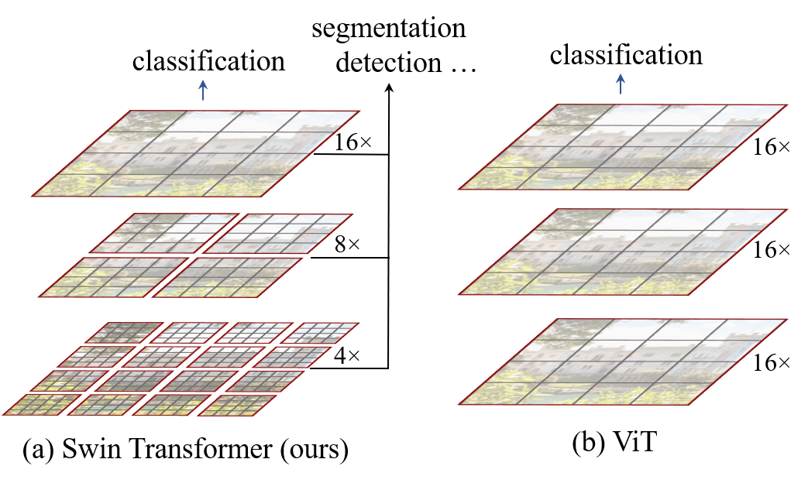

# Swin Transformer: Hierarchical Vision Transformer using Shifted Windows

**论文：** [arXiv](https://arxiv.org/abs/2103.14030) · Ze Liu, Yutong Lin, Yue Cao, Han Hu et al. · 2021
**代码：** https://github.com/microsoft/Swin-Transformer

---

## 一、先搞清楚坑在哪

2020 年 ViT 出来的时候，大家都很兴奋——终于有一个 Transformer 能在 ImageNet 分类上跟 CNN 掰手腕了。但冷静下来仔细一看，ViT 能做的事其实非常有限。

直白说，ViT 有两个硬伤，而且这两个硬伤不是"调调参数就能解决"的那种。

**硬伤 1：算力灾难。** ViT 做全局 self-attention——每个 patch 跟所有其他 patch 算注意力。一张 224x224 的图切成 16x16 patch 后是 14x14=196 个 token，196^2=38k 次 attention 计算，还算能忍。

但视觉任务经常需要处理高分辨率输入。举个例子：如果输入是 1024x1024，patch 数变成 (1024/16)^2 = 4096，attention 量变成 4096^2 = 16M，是 196 情况下的 400 多倍。你根本算不起。

**硬伤 2：没有多尺度。** 这是更本质的问题。CNN 自 AlexNet 以来积累了一个核心经验——视觉任务需要多尺度特征。一幅图里有大象也有蚂蚁，检测大象需要全局特征，检测蚂蚁需要局部细节。ResNet 用四个 stage 逐步下采样：H/4 → H/8 → H/16 → H/32，天然形成了特征金字塔。FPN、U-Net、Mask R-CNN 全部建立在这个金字塔之上。

但 ViT 呢？Patch Embedding 之后就是一个贯穿始终的 Transformer Encoder，永远输出 H/16 x W/16 的单分辨率特征图。没有金字塔，没有多尺度，所以它天然不适合检测和分割。

Swin Transformer 要回答的问题只有一个：**能不能设计一种 Transformer，既有 CNN 的多尺度金字塔，又能把 self-attention 的复杂度从 O(N^2) 降到线性？**

## 二、ViT 的真正问题

这里有必要再挖深一层——ViT 不是"做得不够好"，而是在设计目标上就回避了视觉任务的真实需求。

ViT 把 NLP Transformer Encoder 原封不动搬过来处理图像 patch，这个思路简洁优雅。而它的成功也带来一个错觉：既然分类能做好，那其他任务是不是加个 head 就行？

答案是否定的。

首先，ViT 的特征图分辨率是固定的。patch size=16 时永远是 H/16 x W/16，你没法在低分辨率上做区域提案（RPN 需要 4 层 feature map），也没法在高分辨率上做精细分割。有人试过给 ViT 加 decoder 做分割（SETR），效果很勉强，因为本质上你只有一个尺度的输入给 decoder。

其次，ViT 的计算量跟 patch 数成平方关系。如果你想用更小的 patch（比如 8x8 来保留更多空间细节），patch 数变成 4 倍，计算量变成 16 倍。这条路走不通。

说白了，ViT 是一个**为分类设计的架构偶然在 ImageNet 上做成了**，而不是一个**为视觉设计的通用 backbone**。这两个区别很大。

## 三、Swin 的核心思路

Swin 的设计直觉一句话就能说完：

> 既然 ResNet 的四级金字塔好用，那能不能在 Transformer 里也搭一个同样的金字塔出来？

但这里有个问题：你怎么在 Transformer 里做金字塔？

ResNet 做金字塔靠的是 stride=2 的卷积或 pooling——每过一个 stage，分辨率砍半，通道翻倍。Transformer 没有 stride 卷积这种东西，它的核心操作是 self-attention，操作的对象是 patch token。

Swin 的办法是：**在每个 stage 末尾，用 Patch Merging 把相邻 patch 合并起来。**

```
输入图像 (H x W x 3)
    │
    ▼
┌─────────────────────────────┐
│ Patch Partition             │
│ H/4 x W/4, 每个 patch 4x4x3 │  48 维
└──────────┬──────────────────┘
           │
┌──────────▼──────────────────┐
│ Linear Embedding → C 维      │  Stage 1
│ Swin Block x k               │  H/4 x W/4 x C
└──────────┬──────────────────┘
           │
┌──────────▼──────────────────┐
│ Patch Merging (2x → C)      │  2x 下采样
└──────────┬──────────────────┘
           │
┌──────────▼──────────────────┐
│ Swin Block x k               │  Stage 2
└──────────┬──────────────────┘  H/8 x W/8 x 2C
           │
┌──────────▼──────────────────┐
│ Patch Merging                │
└──────────┬──────────────────┘
           │
┌──────────▼──────────────────┐
│ Swin Block x k               │  Stage 3
└──────────┬──────────────────┘  H/16 x W/16 x 4C
           │
┌──────────▼──────────────────┐
│ Patch Merging                │
└──────────┬──────────────────┘
           │
┌──────────▼──────────────────┐
│ Swin Block x k               │  Stage 4
└──────────┬──────────────────┘  H/32 x W/32 x 8C
```

看到没有？这个结构跟 ResNet-50 的 [3,4,6,3] 四个 stage 完全对应。Stage 1-4 的输出分辨率恰好是 H/4, H/8, H/16, H/32。这意味着你可以直接把 Swin 往 FPN、U-Net、Mask R-CNN 里插，不需要改下游代码。

但多尺度是解决了，复杂度问题呢？Stage 1 有 (H/4) x (W/4) 个 patch。如果 H=W=224，那就是 56x56=3136 个 patch。做全局 attention 是 O(3136^2) ≈ 10M，还行。但如果 H=W=1024，Stage 1 就有 256x256=65536 个 patch——O(65K^2) 等于 42 亿次 attention 计算，没有可行性。

这就引出了 Swin 的第二个关键设计：**窗口自注意力（W-MSA）。**



但先别急——多尺度金字塔和窗口自注意力两者缺一不可。没有窗口自注意力，金字塔搭不起来（Stage 1 算不动）。没有金字塔，窗口自注意力只解决了效率问题，没解决多尺度问题。Swin 的聪明之处在于把这两个问题同时解决。

## 四、网络架构详解（含 Forward Pass）

### 4.1 输入 → Patch Embedding

输入是一张 RGB 图像 $X \in \mathbb{R}^{H \times W \times 3}$。

Swin 使用 **4x4 的 patch size**（ViT 是 16x16）。这样做的好处是保留了更精细的空间信息，但代价是 patch 数量是 ViT 的 16 倍——这也是为什么 Swin 必须有窗口自注意力来降低复杂度。

实现上，Patch Partition 就是一个 kernel=4, stride=4 的卷积：

```python
self.proj = nn.Conv2d(3, embed_dim, kernel_size=patch_size, stride=patch_size)
```

输出形状：$\frac{H}{4} \times \frac{W}{4} \times 48$（48 = 4x4x3）。

然后是 Linear Embedding：一个线性层把 48 维投影到 $C$ 维（Swin-Tiny 中 C=96）。

所以 Stage 1 的输入是 $\frac{H}{4} \times \frac{W}{4} \times C$ 个 token，每个 token 是 C 维向量。

### 4.2 Swin Transformer Block

这是整个架构的基本单元。每个 Swin Block 的结构如下：

```
         输入 (num_patches x C)
              │
    ┌─────────▼──────────┐
    │ LayerNorm           │
    └─────────┬──────────┘
              │
    ┌─────────▼──────────┐
    │ W-MSA / SW-MSA      │  ← 交替使用
    └─────────┬──────────┘
              │
    ┌─────────▼──────────┐
    │ 残差连接 (+)         │
    └─────────┬──────────┘
              │
    ┌─────────▼──────────┐
    │ LayerNorm           │
    └─────────┬──────────┘
              │
    ┌─────────▼──────────┐
    │ MLP (2层, GELU)     │
    │ C → 4C → C           │
    └─────────┬──────────┘
              │
    ┌─────────▼──────────┐
    │ 残差连接 (+)         │
    └─────────┬──────────┘
              │
         输出 (num_patches x C)
```

这里每个 Stage 内部有偶数个 Swin Block。**奇数索引的 Block 用 W-MSA（常规窗口），偶数索引的 Block 用 SW-MSA（偏移窗口）。** 交替出现。

### 4.3 窗口自注意力（W-MSA）的工作过程

假设当前特征图是 $h \times w \times C$（例如 56x56xC）。

**Step 1：窗口划分**

将特征图重塑为不重叠的窗口。默认窗口大小 $M=7$。

```
56x56xC → (56/7 x 56/7) = 8x8 个窗口，每个窗口 7x7xC
         → (64个窗口) x (49个patch/窗口) x C
```

在 PyTorch 中，这一步用 `view` + `permute` 实现：
```python
# 输入: (B, C, H, W)
# 输出: (B, num_windows, window_size*window_size, C)
def window_partition(x, window_size):
    B, C, H, W = x.shape
    x = x.view(B, C, H // window_size, window_size, W // window_size, window_size)
    x = x.permute(0, 2, 4, 3, 5, 1).contiguous()
    x = x.view(-1, window_size * window_size, C)
    return x
```

**Step 2：窗口内自注意力**

每个窗口内的 49 个 patch 做标准的 multi-head self-attention（这里 Swin 用了 relative position bias，后面详述）。

**Step 3：窗口还原**

把窗口重新拼回特征图。

整个过程的计算复杂度：

$$\Omega(\text{全局 MSA}) = 4hwC^2 + 2(hw)^2C$$

$$\Omega(\text{W-MSA}) = 4hwC^2 + 2M^2hwC$$

其中 $h,w$ 是特征图的高宽，$C$ 是通道数，$M=7$ 是窗口大小。

关键看第二项：从 $(hw)^2$ 变成了 $M^2 \cdot hw$。当 $h=w=56$ 时，$(hw)^2=3136^2\approx 9.8M$，而 $M^2 \cdot hw = 49 \times 3136 \approx 0.15M$——**差了两个数量级**。当图像更大时差距更明显。

### 4.4 Shifted Window（SW-MSA）的工作过程

W-MSA 的问题是窗口之间没有信息交流。patch A 在窗口 1，patch B 在窗口 2，它们永远看不到彼此。

Swin 的解法非常巧妙：**在 Block 之间交替窗口划分方式。**


颜色相同的区域表示在同一个窗口内。第 l 层用常规网格（4 个窗口），第 l+1 层把网格偏移 $(\lfloor M/2 \rfloor, \lfloor M/2 \rfloor)$——在 7x7 窗口的情况下就是偏移 (3, 3) 个 patch。

这样，原本在第 l 层分属不同窗口的 patch（比如窗口 1 右下角的 patch 和窗口 2 左下角的 patch），在第 l+1 层就掉进了同一个窗口。跨窗口通信自然发生。

**工程实现上的关键技巧：cyclic shift**

偏移之后，窗口从 4 个变成了 9 个（见上图 $2\times2 → 3\times3$），而且不同窗口的大小不一。如果直接处理，代码复杂且低效。

Swin 的处理方式是 cyclic shift：

```python
# 源码里是这样实现的
shifted_x = torch.roll(x, shifts=(-window_size//2, -window_size//2), dims=(1, 2))
# 然后正常划分窗口做 attention
# 做完后还原
x = torch.roll(shifted_x, shifts=(window_size//2, window_size//2), dims=(1, 2))
```

`torch.roll` 把图像向右下方向循环移位。原本散落在边角的碎片被"转"到了左上角，拼成了一个规则网格。在计算结果时再反向 shift 回去。

这样做的好处是：**实际只需要实现一个 window partition 函数，W-MSA 和 SW-MSA 共用同一套代码**。区别只是 SW-MSA 多了一步 cyclic shift。

有意思的是，Swin 论文的实验表明，shifted window 的延迟远低于 sliding window 方案。根本原因在硬件层面：sliding window 时每个 query pixel 的 key set 都不同，无法利用批量矩阵乘法（batch matmul）加速；而 Swin 的所有窗口大小相同、结构相同，可以一次性做 batch attention，对 GPU 的访存非常友好。

### 4.5 相对位置偏置（Relative Position Bias）

这是 W-MSA 内部的一个关键设计。

标准 self-attention 计算：

$$\text{Attention}(Q,K,V) = \text{SoftMax}(QK^T / \sqrt{d})V$$

Swin 加了一个可学习的**相对位置偏置**：

$$\text{Attention}(Q,K,V) = \text{SoftMax}(QK^T / \sqrt{d} + B)V$$

其中 $B \in \mathbb{R}^{M^2 \times M^2}$ 是一个可学习的偏置矩阵。$B$ 中每个位置的值由两个 patch 之间的**相对位置**决定（不是绝对位置）。

为什么这对视觉重要？因为在 NLP 中 token 的绝对位置有意义（"第一个词"、"第二个词"），但在视觉中，两个 patch 之间的相对偏移（"向左 2 个 patch，向下 3 个 patch"）比它们的绝对坐标重要得多。CNN 天然有这种平移等变性，而 Swin 通过相对位置偏置把这种归纳偏置注入了 Transformer。

### 4.6 Patch Merging（各 Stage 之间的下采样）

每过一个 Stage，Swin 用 Patch Merging 实现 2x 下采样：

```python
# 输入: (B, H, W, C)
# 取 2x2 邻域的 4 个 patch
x = torch.cat([x[..., 0::2, 0::2, :],   # (0,0)
               x[..., 1::2, 0::2, :],   # (1,0)
               x[..., 0::2, 1::2, :],   # (0,1)
               x[..., 1::2, 1::2, :]],  # (1,1)
              dim=-1)  # → (B, H/2, W/2, 4C)
# 线性投影到 2C 维
x = nn.Linear(4C, 2C)(x)
```

这相当于把空间上相邻的 4 个 patch 合并成 1 个，通道数从 C 变成 4C，再投影到 2C。效果：分辨率砍半，通道翻倍。

### 4.7 各变体的 config

| 模型 | C (通道数) | 各 Stage Block 数 | 参数量 |
|------|-----------|-------------------|--------|
| Swin-T | 96 | [2, 2, 6, 2] | 29M |
| Swin-S | 96 | [2, 2, 18, 2] | 50M |
| Swin-B | 128 | [2, 2, 18, 2] | 88M |
| Swin-L | 192 | [2, 2, 18, 2] | 197M |

## 五、核心创新点（为什么这么设计）

### 创新 1：层级特征金字塔

**不是新发明，但首次在 Transformer 中实现。** CNN 的金字塔结构好，所以 Swin 照搬了过来。关键创新在于：用 Patch Merging 替代 stride 卷积来实现下采样，从而在 Transformer 框架内保留了多尺度能力。

### 创新 2：Shifted Window

**这是真正的核心贡献。** 它解决了三个问题：

- **效率**：局部窗口 self-attention 把复杂度从 O(N^2) 降到 O(N)
- **通信**：shifted window 实现了跨窗口信息交换
- **硬件友好**：相同大小的窗口可以批量计算，比 sliding window 快得多

如果没有 shifted window，你可以用全局 attention（太贵）、用 sliding window（太慢）、或者用全连接层（表达能力不够）。Shifted window 在效率、表达力和延迟之间找到了一个很好的平衡。

### 创新 3：相对位置偏置

其实这不是 Swin 原创的（之前在 T5、DeBERTa 里出现过）。但 Swin 证明了它在视觉 Transformer 中至关重要。去掉这个偏置项，Swin-T 的 ImageNet top-1 下降了约 1.2%（论文 Table 4 的数据）。

## 六、公式详解

### 公式 1：复杂度对比

$$\Omega(\text{MSA}) = 4hwC^2 + 2(hw)^2C$$

$$\Omega(\text{W-MSA}) = 4hwC^2 + 2M^2hwC$$

- $h, w$：特征图的高和宽（patch 为单位）
- $C$：通道数
- $M$：窗口大小（默认 7）
- 第一项 $(4hwC^2)$：QKV 投影 + attention 输出投影
- 第二项：attention score 计算

举个例子：$h=56, w=56, C=96, M=7$
- 全局 MSA：$4 \times 3136 \times 9216 + 2 \times 3136^2 \times 96 = 115M + 1.9B$
- 窗口 MSA：$4 \times 3136 \times 9216 + 2 \times 49 \times 3136 \times 96 = 115M + 29M$

第一项相同（QKV 投影不取决于 attention 范围），第二项差了 64 倍。

### 公式 2：SW-MSA 的 attention 计算

一个 Swin Block 的计算过程：

$$\hat{z}^l = \text{W-MSA}(\text{LN}(z^{l-1})) + z^{l-1}$$

$$z^l = \text{MLP}(\text{LN}(\hat{z}^l)) + \hat{z}^l$$

$$\hat{z}^{l+1} = \text{SW-MSA}(\text{LN}(z^l)) + z^l$$

$$z^{l+1} = \text{MLP}(\text{LN}(\hat{z}^{l+1})) + \hat{z}^{l+1}$$

这里 LN 是 LayerNorm，W-MSA 和 SW-MSA 交替出现。每个 Block 的输出形状跟输入相同（residual）。

### 公式 3：相对位置偏置

$$B[i,j] = \hat{B}[p(i,j)]$$

其中 $\hat{B}$ 是一个可学习的参数表，$p(i,j)$ 将窗口内第 i 个 patch 和第 j 个 patch 之间的**二维相对偏移**映射到一个索引。窗口大小 $M=7$，所以相对位置范围是 $[-6, 6]$，二维共有 $13 \times 13 = 169$ 个可能的位置偏移，对应 $\hat{B} \in \mathbb{R}^{169 \times \text{num_heads}}$。

## 七、实验结果

| 模型 | ImageNet-1K top-1 | COCO box AP (Mask R-CNN 1x) | COCO mask AP | ADE20K mIoU |
|------|-------------------|------------------------------|--------------|-------------|
| Swin-T | 81.3% | 46.0 | 41.6 | 44.5 |
| Swin-S | 83.0% | 48.5 | 43.1 | 47.5 |
| Swin-B (224^2) | 83.5% | 49.5 | 44.1 | 49.3 |
| Swin-B (384^2) | 85.2% | - | - | - |
| Swin-L (224^2) | 86.4% | - | - | - |
| Swin-L (384^2) | 87.3% | - | - | - |
| Swin-L + HTC++ (test-dev) | - | **58.7** | **51.1** | **53.5** |

注：检测结果用 Mask R-CNN 在 1x schedule（12 epoch）下训练。最后一行是用更强的 HTC++ framework 在 COCO test-dev 上的结果，对应论文宣称的 +2.7 box AP 提升。

这里有个值得注意的点：Swin-T 的参数量是 29M，跟 ResNet-50（25M）相近，分类精度 81.3% 也接近。但 Swin-T 在检测上比 ResNet-50 好不少（46.0 vs ~40 左右的 box AP），说明层级 Transformer backbone 对密集预测的增益是真实存在的。

## 八、代码对照

Swin Transformer 源码中几个值得注意的实现细节：

1. **窗口划分**：实际是用 `view + permute` 完成的，不是 `unfold`。这样做的好处是**没有内存拷贝**，只是 tensor 的 reshape + 维度交换。

2. **Cyclic shift 的实现**：`torch.roll` 之后会在移位边界产生本来不相邻的 patch 拼在一起的情况，所以需要 **attention mask** 来阻止这些"伪相邻"的错误 attention。SW-MSA 比 W-MSA 多了一个 mask 参数。

3. **训练技巧**：Swin 的训练使用了 AdamW（$\beta_1=0.9, \beta_2=0.999$）、cosine decay LR、有的变体用了 stochastic depth（随机丢弃整个 Block 的残差路径，但 Swin Block 没有用到 dropout）。

4. **Relative position bias**：实际是用 `nn.Parameter(torch.zeros((2*window_size-1, 2*window_size-1, num_heads)))` 然后通过索引表查表得到 $B$ 矩阵。索引表是一个预先算好的二维偏移 → 一维索引的映射。

5. **分类 head**：全局平均池化 + LayerNorm + 线性层，跟 ViT 类似。

## 九、在技术路线上的位置

```
2015  ResNet (残差连接，四层级)
       │
2017  Transformer (Attention Is All You Need)
       │
2020  ViT (Transformer 做分类，单尺度)
       │
2021  Swin Transformer (层级 + 窗口 attention)  ← ★ 本篇
       │
2022  ConvNeXt (从 Swin 吸取经验改回纯 CNN)
       │
       ├── Focal Transformer (可变窗口)
       ├── CSWin (cross-shaped 窗口)
       └── MViT (多尺度在时间域)
```

Swin 的关键意义是：它证明了 Transformer 不只是"一种能分类的东西"，而是**可以替代 ResNet 做任何视觉任务的通用 backbone**。这之后，检测和分割领域的 SOTA 从 ResNeXt 变成了 Swin，ConvNeXt 又从 Swin 反向吸收了设计经验改回纯 CNN——两条路线开始融合。

## 十、局限

1. **窗口大小固定**：7x7 窗口在所有 Stage 都一样，CNN 的可变感受野（低层感受野小、高层大）在 Swin 里是通过金字塔结构间接实现的，而不是通过窗口大小变化。后续 Focal Transformer、CSWin 在做的事情本质上就是让窗口变得更灵活。

2. **实现复杂度**：cyclic shift + masking 虽然工程优雅，但比 ViT 的全局 attention 复杂度高了一个数量级（在代码层面）。ConvNeXt 能找到纯卷积取得同样好的结果，说明 Swin 的优势可能来自"层级结构"而非"attention 机制本身"。

3. **分类不如专注分类的模型**：Swin-L 384^2 的 87.3% ImageNet top-1 在当时不如 CoAtNet 等模型。Swin 的真正战场是密集预测任务。

## 十一、小结

Swin Transformer 的核心贡献是两个设计组合：**层级特征金字塔 + shifted window 自注意力**。前者解决了 Transformer 没有多尺度的问题，后者让前者在计算上可行。这两个设计加在一起，让 Transformer 第一次成为真正通用的视觉 backbone。

---

*Paper reading generated by paper-read skill. Rounds: 1. Accuracy: ✅ Logic: ✅ Readability: ✅*
