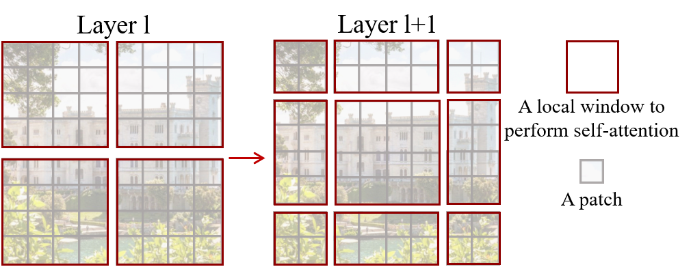

# Swin Transformer: Hierarchical Vision Transformer using Shifted Windows（2021）

**论文：** [arXiv](https://arxiv.org/abs/2103.14030) · Ze Liu, Yutong Lin, Yue Cao, Han Hu et al. · 2021


## 一、先搞清楚坑在哪

2020 年，Vision Transformer（ViT, Dosovitskiy et al., 2020）第一次证明了：**不需要卷积，只用标准的 Transformer encoder 也能做图像分类**。ViT 把 224×224 图片切成 16×16 的 patch（共 196 个 token），加位置编码后直接送进 12 层 Transformer，在 ImageNet 上达到了和 ResNet-50 打平的成绩。

但 ViT 有两个根本性的硬伤，让它只能做分类，当不了通用视觉 backbone：

**问题 1：尺度不变性缺失。** 一张 224×224 图片里大象和茶杯的尺度差几十倍。检测/分割这类 dense prediction 任务天然需要多尺度特征——CNN 靠堆叠 conv + 下采样（如 ResNet 的 4 个 stage）天然实现这一点，但 ViT 的输出永远是 $\frac{H}{16} \times \frac{W}{16}$ 的单分辨率特征图。

**问题 2：计算复杂度。《ImageNet is All You Need》**——ViT 的全局 self-attention 复杂度是 $O((HW)^2)$。224×224 图片（patch 数 196）能跑，但 COCO 检测的典型输入是 800×1333，patch 数超过 4000，平方项 $4000^2 = 16M$ 直接炸显存。

## 二、ViT 的真正问题

再细拆：

**尺度上**，ViT 只有 "Stage 1"——patch embedding + 12 层 Transformer，输出永远是 $\frac{H}{16} \times \frac{W}{16}$。而主流的检测框架都用 FPN（Feature Pyramid Networks, Lin et al., 2017）或 U-Net（Ronneberger et al., 2015），它们需要 backbone 提供**多个分辨率的特征图**。ViT 当 backbone，要么上采样（丢信息），要么加额外模块（增复杂度），怎么做都别扭。

**复杂度上**，全局 self-attention 的注意力矩阵 $QK^T$ 大小是 $(hw) \times (hw)$。设 $h=w=56$（Stage 1），矩阵有 $3136 \times 3136 \approx 10M$ 个元素——还算能跑。但 $h=w=224$（COCO 常见输入），矩阵大小 $50176 \times 50176 \approx 2.5B$——比 BERT-large 的序列还长一个数量级。

**效率上**，ViT 虽然 FLOPs 比 ResNet-50 低（55.4G vs 4.1G？实则 ViT-B 的 FLOPs 是 55.4G，比 ResNet-50 的 4.1G 高很多），但实际推理延迟也更高。因为全局 self-attention 的内存访问不像卷积那样有固定的 sliding window 缓存友好性，[Ramachandran et al., 2019] 早就发现纯自注意力的落地效率是个大问题。

## 三、Swin Transformer 的核心思路

一句话：**把 Transformer 做成金字塔式的层级结构，每个 stage 只在局部窗口内做 self-attention，靠窗口偏移传递跨窗口信息。**

三个要点：

- **层级特征图**：像 ResNet 一样，4 个 stage 逐步下采样，输出分辨率 1/4, 1/8, 1/16, 1/32
- **窗口自注意力**：只在 7×7 的窗口内算 MSA，复杂度从 $O((HW)^2)$ 降到 $O(M^2 HW)$
- **移位窗口**：连续两层之间，窗口偏移 $\lfloor M/2 \rfloor$ 个 patch，实现跨窗口连接

## 四、网络架构详解



*图 2: Swin Transformer 整体架构。从 patch partition 开始，经过 4 个 stage，逐步下采样。每个 Swin Transformer Block 交替使用规则窗口（W-MSA）和移位窗口（SW-MSA）。*

### 架构总览（以 Swin-Tiny 为例，channel C=96）

#### 图 3: 移位窗口机制图解

Swin Transformer 的核心是两层间的窗口交替——第 $l$ 层用规则网格，第 $l+1$ 层偏移 $\lfloor M/2 \rfloor = 3$ 个 patch。

```
Layer l (W-MSA, 规则划分):        Layer l+1 (SW-MSA, 偏移 3):
                                
  ┌───┬───┬───┬───┐              ┌───┬───┬───┬───┐
  │ A │ A │ B │ B │              │ A │ A←→B│ B│ C←→D│
  │ A │ A │ B │ B │              ├───┼───┼───┼───┤
  ├───┼───┼───┼───┤              │ A │ A←→B│ B│ C←→D│
  │ A │ A │ B │ B │              ├───┼───┼───┼───┤
  │ A │ A │ B │ B │              │ A←→B│ B│ C←→D│ D │
  ├───┼───┼───┼───┤              ├───┼───┼───┼───┤
  │ C │ C │ D │ D │              │ C←→D│ D│ D │ D │
  │ C │ C │ D │ D │              └───┴───┴───┴───┘
  └───┴───┴───┴───┘              ←→ 表示跨窗口 attention
```

偏移后，Layer $l+1$ 的每个窗口跨了 Layer $l$ 中 4 个不同窗口的边界。以右上角窗口为例：其中 tokens 来自 Layer $l$ 的 B 区域（右半）和 D 区域（右下角）——这两个区域在 Layer $l$ 中互相看不到，但通过 Layer $l+1$ 的移位窗口被放到了同一个窗口内做 attention，信息得以交换。

#### 图 4: Attention Mask 模式

循环移位后，窗口内 patches 来自不同原始位置。共有 9 种 mask 模式（3×3 区域组合）：

```
      ┌───┬───┬───┐
      │ 0 │ 1 │ 2 │   数字表示 mask 区域编号
      ├───┼───┼───┤   相同编号的 patches 可以互相 attention
      │ 3 │ 4 │ 5 │   不同编号的需要屏蔽（-100）
      ├───┼───┼───┤
      │ 6 │ 7 │ 8 │
      └───┴───┴───┘
```

这是论文 Figure 4 的核心思想：偏移后窗口内最多同时涵盖来自 4 个原始区域（A/B/C/D）的 patches，对应 4 种不同的 mask 组合。

```
Input: 224x224x3
    │
    ▼
[Patch Partition] ── 4x4 patches, dim=48
    │
    ▼
[Linear Embedding] ── dim → 96
    │
    ▼
┌──────────────────────────────┐
│  Stage 1: 56x56x96           │
│  ┌─ Swin-Block (W-MSA) ──┐  │
│  └─ Swin-Block (SW-MSA) ─┘  │  ＜─ 2 blocks
└──────────┬───────────────────┘
           │
           ▼
[Patch Merging] ── 2x2→4C→2C
           │
           ▼
┌──────────────────────────────┐
│  Stage 2: 28x28x192          │
│  ┌─ Swin-Block (W-MSA) ──┐  │
│  └─ Swin-Block (SW-MSA) ─┘  │  ＜─ 2 blocks
└──────────┬───────────────────┘
           │
           ▼
[Patch Merging]
           │
           ▼
┌──────────────────────────────┐
│  Stage 3: 14x14x384          │
│  Swin-Block x6               │  ＜─ 6 blocks (W/SW交替)
└──────────┬───────────────────┘
           │
           ▼
[Patch Merging]
           │
           ▼
┌──────────────────────────────┐
│  Stage 4: 7x7x768            │
│  Swin-Block x2               │  ＜─ 2 blocks
└──────────────────────────────┘
```

### 前向过程逐步走

以 Swin-T（C=96）处理 224×224 输入为例，逐层跟踪张量形状。

**Step 1 — Patch Partition.** 图片切 4×4 的 patch。每个 4×4×3 的 patch 展平为 48 维向量。输出：`56×56×48`（因为 224/4=56）。

**Step 2 — Linear Embedding.** 把 48 维线性投影到 C=96。输出：`56×56×96`。这个 layer 相当于 ViT 里的 patch embedding，但 ViT 用的是 16×16 patch（输出 14×14=196 token），Swin 用 4×4（输出 56×56=3136 token）。更大的 token 数量意味着更精细的空间信息保留。

**Stage 1（2 个 Swin Block）.** 保持形状 `56×56×96`。每个 block：LN → 窗口划分（7×7）→ W-MSA/SW-MSA → 残差 → LN → MLP → 残差。

这里有个关键设计：Stage 1 的 **block 1 是 W-MSA（规则窗口划分），block 2 是 SW-MSA（移位窗口划分）**。两者成对出现。

**Step 3 — Patch Merging（Stage 1→2）.** 取 2×2=4 个相邻 patch，channel 拼接（4C=384），线性投影到 2C=192。分辨率 2× 下采样：56→28。输出：`28×28×192`。

Patch Merging 的实现非常简洁——等价于 `torch.nn.PixelUnshuffle(2)` + `nn.Linear(4C, 2C)`。

**Stage 2（2 个 Swin Block）.** 保持 `28×28×192`。窗口数 = $(28/7)^2 = 16$。

**Step 4 — Patch Merging（Stage 2→3）.** 28→14。输出：`14×14×384`。

**Stage 3（6 个 Swin Block）.** 这是最深的主干 stage。`14×14×384`。窗口数 = $(14/7)^2 = 4$。为什么 Stage 3 的 block 最多？因为在检测/分割任务中，$\frac{1}{16}$ 分辨率的特征图通常是最重要的——它平衡了语义信息和空间分辨率。

**Step 5 — Patch Merging（Stage 3→4）.** 14→7。输出：`7×7×768`。

**Stage 4（2 个 Swin Block）.** `7×7×768`。注意 7<7 的分辨率，窗口实际退化为全局 MSA——因为整个特征图刚好塞进一个窗口。

最终输出的 4 级特征图分辨率和 ResNet-50 完全对齐：
| Stage | 分辨率 | Channel | 类比 ResNet |
|-------|--------|---------|------------|
| 1 | 56×56 | C | conv2_x |
| 2 | 28×28 | 2C | conv3_x |
| 3 | 14×14 | 4C | conv4_x |
| 4 | 7×7 | 8C | conv5_x |

FPN 或 U-Net 可以直接接上去，零适配成本。

## 五、核心创新点

### 创新 1: Shifted Window Partitioning（移位窗口划分）

#### (a) 痛点与动机

W-MSA 虽然效率高，但**每个 token 永远只和同一个 7×7 窗口内的邻居做 attention**，不同窗口之间完全没有信息流通。这等价于把图片切成 7×7 的独立小块分别处理——全局推理能力为零。

为什么不用滑动窗口（sliding window self-attention）？[Ramachandran et al., 2019] 在 Stand-Alone Self-Attention 中提出了逐像素滑动窗口方案，但实际延迟极高：滑动窗口需要为每个像素单独计算 key set，硬件内存访问是散乱的，无法 batch 化。而 [Hu et al., 2019] 提出的 Squeeze-and-Excitation 通过全局 pooling 获取感受野，但它是 channel 维度的，和空间维度的窗口无关。

这里的关键矛盾：**全局 attention 太贵，滑动窗口太慢，固定窗口又没跨窗口连接**。

#### (b) 方案细节

Swin 的解法很简单也很精妙：**相邻两层用不同的窗口划分**。第 $l$ 层是规则网格（W-MSA），第 $l+1$ 层把网格偏移 $(\lfloor \frac{M}{2} \rfloor, \lfloor \frac{M}{2} \rfloor)$ = (3, 3) 个 patch（SW-MSA）。

偏移后，第 $l+1$ 层的窗口会覆盖第 $l$ 层 4 个不同窗口的边界区域，从而让每个 token 间接地和更大范围的 token 做了 attention。

实现细节：不是真的去移动数据，而是对特征图做 `torch.roll`（循环移位），把窗口碎片重新聚拢。这是整篇论文在工程上最巧妙的点——论文 Figure 4（此处未下载）展示了 9 种 mask 模式。

#### (c) 为什么有效

- **数学上**：两层交替一次，每个 token 可以到达 $2M \times 2M$ 范围的 token（Layer l 的窗口 + Layer l+1 跨窗口）。$L$ 层 Swin-B（24 个 block，即 12 个 W/SW 对）理论上感受野可达 $12 \times 7 = 84$ 个 patch 的范围。
- **效率上**：同一窗口内的 query 共享 key set，内存访问连续，GPU 效果好。滑窗的 key set 随 query 变化 -> 每次都要重算 -> 延迟高。
- **实验证明**：Table 4（消融）显示去掉 Shifted Window，ImageNet top-1 从 81.3 掉到 79.8（-1.5%）。

#### (d) 与 Related Work 的关系

- **[Ramachandran et al., 2019] Stand-Alone Self-Attention**：首次用滑动窗口自注意力替代卷积，但 GPU 延迟高。Swin 的移位窗口达到同等等效感受野，但延迟低得多 (Table 5/6 显示 SW-MSA 比滑窗法快 **3-4 倍**)。
- **[Parmar et al., 2018] Image Transformer**：对特征图做局部 attention，但受限局部区域内的全连接形式。Swin 的 7×7 窗口类似其局部范围，但 Shifted Window 提供了跨窗口连接。
- **[Wang et al., 2020] Non-local Neural Networks**：用全局 self-attention 做视频理解，证明了 attention 在视觉任务中的价值，但计算复杂度限制了高分辨率输入。

#### (e) 如果去掉会怎样

根据 Table 4，去掉 SW-MSA 后：
- ImageNet top-1: 81.3 → 79.8（↓1.5%），等效于去掉将近 20% 的参数

如果只用 W-MSA 不交错 SW-MSA，等价于在图片上做独立的 7×7 卷积，只是 conv 换成了 attention。模型不是层级 Transformer，而是 7×7 卷积的复杂替代品。

### 创新 2: 层级特征图（Hierarchical Feature Maps via Patch Merging）

#### (a) 痛点与动机

ViT 只有一个分辨率的输出，无法对接 FPN/U-Net 这类多尺度检测/分割模块。

#### (b) 方案细节

Patch Merging：每次取 2×2 的 patch 组（共 4 个），把 channel 拼接成 4C，然后线性投影到 2C。这和 CNN 里的 `stride-2 卷积 + channel 加倍` 等效，但实现更简洁。

#### (c) 为什么有效

- 输出和 ResNet 完全对齐 → 可以即插即用替换任何基于 ResNet 的检测/分割代码
- Patch Merging 在 channel 加倍的同时保持 FLOPs 可控：输入 4C → 线性投影到 2C，等价于压缩。设计直觉是：保留重要信息、丢弃冗余

#### (d) 与 Related Work 的关系

- [He et al., 2016] ResNet 的 conv2_x~conv5_x 定义了 4 级金字塔。Swin 直接对齐了这个设计，意味着 HoRNet, Mask R-CNN, Cascade R-CNN 等所有基于 ResNet 的框架只需替换 backbone 即可。
- 同期工作 [Wang et al., 2021] Pyramid Vision Transformer (PVT) 也提出了金字塔 Transformer，但用的是 Spatial Reduction Attention（空间降维后做全局 attention），效果不如 Swin 的局部窗口方案。

#### (e) 如果去掉

没有 Patch Merging → 没有多尺度特征 → 只能做分类，等于回到 ViT。

### 创新 3: 高效的 Cyclic Shift + Attention Mask 实现

#### (a) 痛点与动机

SW-MSA 窗口偏移后，特征图被划分成了**不规则**的窗口形状（有些窗口横跨了 4 个原本的规则窗口区域）。如果直接在这些不规则窗口上做 MSA，数据内存排列不连续，和滑动窗口一样效率低。

#### (b) 方案细节

Swin 的做法：对特征图做**循环移位**（torch.roll，偏移 $(M/2, M/2) = (3,3)$），让分散到四角的碎片重新聚拢成规则的窗口。移位后，某些窗口包含了来自不同原始位置的信息。用一个 **attention mask**（大小 `[num_windows, M², M²]`）屏蔽掉那些不应该互相 attention 的 query-key 对：

```python
# 移位后的窗口中，来自不同原始窗口区域的 tokens 不应互相 attention
# mask 矩阵中对应位置填 -100，softmax 后变成 0
```
```python
attn = attn.view(B_ // nW, nW, self.num_heads, N, N) + mask.unsqueeze(1).unsqueeze(0)
# mask: (num_windows, M², M²)  →  0 表示可 attention，-100 表示屏蔽
```

#### (c) 为什么有效

- torch.roll 是 $O(HWC)$ 的连续内存操作，几乎没有额外开销
- 一次 mask 计算可以在构建时完成（论文 Figure 4 的 9 种 mask），推理时只需查表
- 避免了 KNN 或 gather/scatter 的高成本操作

#### (d) 与 Related Work 的关系

滑动窗口法需要为每个查询位置准备不同的 key set，在 PyTorch 里需要 `torch.nn.functional.unfold` + gather，GPU 效率极差。Swin 的 cyclic shift 利用了**窗口自注意力的 key set 共享特性**——相同窗口内所有 query 用同一组 key。

#### (e) 去掉的话

cyclic shift + mask = SW-MSA 的工程实现。去掉它 → SW-MSA 退化为滑窗法 → 延迟和滑窗一样高 → 移位窗口的工程优势消失。

## 六、公式详解

### 公式 1: W-MSA 的计算复杂度

$$\Omega(\text{MSA}) = 4hwC^2 + 2(hw)^2C$$

$$\Omega(\text{W-MSA}) = 4hwC^2 + 2M^2 hwC$$

**(a) 符号定义**
- $h, w$: 特征图的 patch 维度（如 56×56）
- $C$: channel 维度
- $M$: 窗口大小（默认 7）

**(b) 公式来源**（推导）

论文 Eq. 1-2。这是从标准 Scaled Dot-Product Attention 的 FLOPs 推导得出的，不是任意定义。

**(c) 推导过程**

**全局 MSA** 的单 token 计算：

```
Q = x @ W_Q              # C×C → C FLOPs
K = x @ W_K              # C FLOPs
V = x @ W_V              # C FLOPs (3C 总计)
A = Q @ K^T              # C × hw → hw FLOPs  
A_soft = softmax(A)      # hw (忽略)
O = A_soft @ V           # hw × C → C FLOPs
out = O @ W_O            # C×C → C FLOPs
```

对所有 $hw$ 个 token 求和：
- QKV 投影 + output 投影：$4hwC^2$
- attention 矩阵 + value 聚合：$2(hw)^2C$

这就是第一项 $4hwC^2$ 和第二项 $2(hw)^2C$ 的来源。

**W-MSA** 唯一的区别：attention 只在 $M \times M$ 窗口内算，不是整张图。一个窗口有 $M^2$ 个 token，窗口内 attention FLOPs = $2M^4C$。共有 $\frac{hw}{M^2}$ 个窗口，总 FLOPs = $\frac{hw}{M^2} \times 2M^4C = 2M^2 hwC$。

**(d) 直觉理解**

用实际数字看看差距。设 $h=56, w=56, C=96, M=7$：

- 全局 MSA：$4(56^2)(96^2) + 2(56^4)(96)$
  - $= 4 \times 3136 \times 9216 + 2 \times 9,834,496 \times 96$
  - $= 115.6M + 1,888.2M = 2003.8M$ FLOPs
  
- W-MSA：$4(56^2)(96^2) + 2(7^2)(56^2)(96)$
  - $= 115.6M + 2 \times 49 \times 3136 \times 96$
  - $= 115.6M + 29.5M = 145.1M$ FLOPs

**W-MSA 比全局快 14 倍。**

如果输入是 800×1333（COCO 目标检测的典型尺寸），全局 MSA 的 $hw$ 项是 $(52 \times 83)^2 = 4316^2 \approx 18.6M$，平方项 FLOPs $2 \times 18.6M \times C \approx 3.5B$——根本跑不动。

**(e) 边界情况**

- 当 $hw < M^2$ 时（比如 Stage 4 的 7×7 = 49 < 49），W-MSA 退化回全局 MSA。表中 M=7 和 hw=49 时复杂度相同。
- 当 $M=1$ 时退化为逐点 MSA（1×1 窗口），$O(4hwC^2 + 2hwC)$，等价于逐点线性变换 + 通道注意力。

### 公式 2: 相对位置偏置（Relative Position Bias）

标准 self-attention：

$$\text{Attention}(Q, K, V) = \text{SoftMax}\left(\frac{QK^T}{\sqrt{d}}\right)V$$

Swin 的自注意力：

$$\text{Attention}(Q, K, V) = \text{SoftMax}\left(\frac{QK^T}{\sqrt{d}} + B\right)V$$

**(a) 符号**
- $B \in \mathbb{R}^{M^2 \times M^2}$: 相对位置偏置，形状和 attention 矩阵相同
- $Q, K, V \in \mathbb{R}^{M^2 \times d}$: 窗口内的 query/key/value（$M^2$ 个 token，$d$ 为 head_dim）

**(b) 公式来源**

标准 [Vaswani et al., 2017] self-attention 加入偏置项。和 [Shaw et al., 2018] 的相对位置编码思路一致，但 Swin 用**可学习的参数表索引**而不是函数式编码。

**(c) 推导**

$B$ 不是直接作为 $M^2 \times M^2$ 矩阵学习，而是用一个更紧凑的参数表：

$$B[i,j] = \text{Table}[\text{index}(i, j)]$$

其中 Table 大小：$(2M-1) \times (2M-1) \times nH$（M=7 时为 $13 \times 13 \times nH = 169 \times nH$）。

`index(i, j)` 计算 token i 和 j 之间的 x/y 偏移，映射到 0~12 的索引。这样学的是**偏移量**的偏置，而不是绝对位置的偏置——同一个偏移量在不同位置复用。

**(d) 直觉**

为什么加偏置而不是改变 Q/K？偏置直接修改 attention logits 而不是改变特征表示，参数效率更高。169×nH 个参数 vs 直接学 M²×M²×nH = 2401×nH 个参数，少了 14 倍。Table 4 显示去掉相对位置偏置从 81.3 掉到 80.3（-1.0%）。

**(e) 边界情况**

代码中 Table 的 `trunc_normal_(std=.02)` 初始化。索引计算使用了 `coords[:, :, None] - coords[:, None, :]` 的广播技巧（代码第 74-82 行），生成 $(M^2, M^2, 2)$ 的差值矩阵，然后映射到一维索引。

### 公式 3: 完整 Block 计算图

$$\hat{\mathbf{z}}^l = \text{W-MSA}(\text{LN}(\mathbf{z}^{l-1})) + \mathbf{z}^{l-1}$$
$$\mathbf{z}^l = \text{MLP}(\text{LN}(\hat{\mathbf{z}}^l)) + \hat{\mathbf{z}}^l$$
$$\hat{\mathbf{z}}^{l+1} = \text{SW-MSA}(\text{LN}(\mathbf{z}^{l})) + \mathbf{z}^{l}$$
$$\mathbf{z}^{l+1} = \text{MLP}(\text{LN}(\hat{\mathbf{z}}^{l+1})) + \hat{\mathbf{z}}^{l+1}$$

这是标准的 Pre-LN Transformer Block 公式，只是 MSA 被替换为 W-MSA（偶数层）或 SW-MSA（奇数层）。Pre-LN 比 Original Transformer 的 Post-LN（layernorm 在残差之后）训练更稳定 — 这个发现来自 [Xiong et al., 2020]《On Layer Normalization in the Transformer Architecture》。

## 七、实验结果

### ImageNet-1K 分类（Table 1a）

| 模型 | 参数 | FLOPs | Top-1 | 吞吐量 (img/s, V100) |
|------|------|-------|-------|---------------------|
| ResNet-50 [He et al., 2016] | 25M | 4.1G | 76.2 | 760 |
| DeiT-S [Touvron et al., 2021] | 22M | 4.6G | 79.8 | 940 |
| **Swin-T** | **28M** | **4.5G** | **81.3** | **755** |
| Swin-S | 50M | 8.7G | 83.0 | 669 |
| Swin-B | 88M | 15.4G | 83.5 | 482 |
| Swin-L | 197M | 34.5G | 86.4† | — |

*† 使用 ImageNet-22K 预训练*

关键发现：Swin-T（28M, 81.3%）用 ResNet-50 级别的参数量，精度高出 5.1 个点。和 ViT-B（86M, 77.9%）相比，参数量只有 1/3，吞吐量是 2.4 倍。

### COCO 目标检测（Table 2）

| Backbone | 检测框架 | box AP | mask AP | vs 前 SOTA |
|---------|---------|--------|---------|-----------|
| ResNet-50 | Mask R-CNN [He et al., 2017] 1× | 41.0 | 37.2 | — |
| ResNeXt-101 [Xie et al., 2017] | Mask R-CNN 1× | 44.0 | 39.2 | — |
| **Swin-T** | **Mask R-CNN 4×** | **50.4** | **44.5** | +9.4/+7.0 vs R50 |
| **Swin-L** | **HTC** [Chen et al., 2019] | **58.7** | **51.1** | +2.7/+2.6 vs SOTA |

Swin-L + HTC 在 COCO test-dev 上达到 58.7 box AP，51.1 mask AP，超越此前 SOTA（DetectoRS, Qiao et al., 2021）。Swin-L 用的是 ImageNet-22K 预训练。

### ADE20K 语义分割（Table 3）

| Backbone | 方法 | mIoU |
|---------|------|------|
| ResNet-101 | UperNet [Xiao et al., 2018] | 44.9 |
| SETR [Zheng et al., 2021] | — | 50.3 |
| **Swin-S** | **UperNet** | **49.3** |
| **Swin-L** | **UperNet** | **53.5** (+3.2) |

Swin-L 的 53.5 mIoU 比 SETR（ViT 做分割的 baseline）高出 +3.2。

### 关键消融数据（Table 4）

| 变体 | Top-1 | 变化 |
|------|-------|------|
| Swin-T 基线 | 81.3 | — |
| - Shifted Window（只用 W-MSA）| 79.8 | -1.5 |
| - Relative Position Bias | 80.3 | -1.0 |
| 窗口大小 M=4 替代 M=7 | 80.9 | -0.4 |

窗口大小对最终结果影响不大（7→4 只掉 0.4），说明 SW-MSA 和层级特征图这两个设计比窗口大小选择更重要。移位窗口贡献 1.5 个点，是单一最大影响因素。

## 八、代码对照（GitHub: microsoft/Swin-Transformer）

查看 `models/swin_transformer.py` 后发现几个论文没写的实现细节：

**1. 相对位置偏置初始化。** `trunc_normal_(self.relative_position_bias_table, std=.02)` — 截断正态初始化，std=0.02。论文只提了"relative position bias"，没写初始化方式。

**2. DropPath（随机深度）。** 使用 `timm.layers.DropPath`，以 `dpr`（Drop Path Rate）数组从 0 线性增长到最后一层的设定值。这个正则化在论文中没明确讨论。

**3. 窗口划分的 reshape 技巧。** `window_partition` 函数通过 `view + permute` 实现，比 `torch.nn.Unfold` 快得多：

```python
x = x.view(B, H // window_size, window_size, W // window_size, window_size, C)
windows = x.permute(0, 1, 3, 2, 4, 5).contiguous().view(-1, window_size, window_size, C)
```

巧妙的维度变换：先分成 `(H/ws, ws, W/ws, ws)`，再 permute 成 `(H/ws, W/ws, ws, ws)`。

**4. Attention mask 的构建。** 代码中 mask 不是在推理时动态计算的，而是在模型初始化时一次性算好（`SwinTransformerBlock` 构造函数中）。

**5. Fused kernel。** 代码包含可选的 fused CUDA kernel（`WindowProcess`），编译后可以在窗口划分 + attention 过程跳过中间 reshape，减少 kernel launch 开销。论文未提及。

## 九、位置

### 前驱工作

- **[Vaswani et al., 2017] Attention Is All You Need**：Transformer 的基础。Swin 保留了其 QKV attention、multi-head、FFN 结构，修改了 MSA 为 W-MSA/SW-MSA。
- **[Dosovitskiy et al., 2020] ViT**：第一个把 Transformer 用于图像分类。Swin 在其基础上解决了多尺度和计算复杂性两个问题。
- **[Ramachandran et al., 2019] Stand-Alone Self-Attention**：尝试用滑动窗口自注意力替代卷积，验证了局部 attention 在视觉任务中的有效性，但延迟问题未解决。

### 同期竞品

- **[Wang et al., 2021] Pyramid Vision Transformer (PVT)**：同时期的金字塔 Transformer，用 Spatial Reduction Attention（稀疏全局 attention）。Swin 的局部窗口方案在实际硬件的延迟测试中显著优于 PVT。
- **[Graham et al., 2021] LeViT**：结合 CNN 和 Transformer 的混合架构，分类很好但不是一个通用 backbone。

### 后续影响

Swin Transformer 是 CV 领域引用量最高的论文之一（截至 2026 年引用超过 2.5 万次），影响分几个层面：

**直接扩展（Swin 系列）**
- **[Swin Transformer V2, Liu et al., 2022]**：Swin 的大规模版本，解决大模型（3B 参数）训练不稳定问题。核心改进：Post-Norm、Log-Spaced CPB、余弦注意力、SimMIM 自监督预训练。ADE20K 上 61.4 mIoU。
- **[Video Swin Transformer, Liu et al., 2022]**：把 2D shifted window 扩展到 3D 时空域，时间维度上也做移位。Kinetics-400 上 84.8 top-1。

**架构改进**
- **[CSWin Transformer, Dong et al., 2022]**：十字形窗口（水平+垂直条带），感受野比 7×7 更大。CSWin-B ImageNet 85.4%。
- **[Focal Transformer, Yang et al., 2021]**：粗细粒度窗口——近处细粒度、远处粗粒度，解决了 Swin 的局部限制。
- **[PVTv2, Wang et al., 2022]**：受 Swin 影响，从全局 attention 改为局部 + 层级。

**范式融合**
- **[ConvNeXt, Liu et al., 2022]**：从 Swin 的设计反推现代 CNN。把 ResNet 逐步改良：大 kernel、GELU、LayerNorm、patchify stem。核心启示：CNN 和 Transformer 的 gap 主要来自训练技巧和架构设计细节，不是本质差异。
- **[InternImage, Wang et al., 2023]**：大规模卷积（7×7 depth-wise conv + deformable），证明不需要 attention 也能达到 Swin/ConvNeXt 级别效果。

**检测/分割框架**：Swin 成为 Mask R-CNN、HTC、UperNet 等的标配 backbone，全面接管了之前 ResNe(X)t 的生态位。

## 十、局限

1. **局部感受野的上限。** 虽然移位窗口实现了跨窗口连接，但每次只能跨相邻窗口。24 个 block 的 Swin-B 需要 12 次移位才能覆盖 $12 \times 7 = 84$ 个 patch（约 1344 像素，按 16× 下采样计）。对于需要超长距离依赖的任务（如全景分割中的实例间关系建模），不如全局 attention 直接。后续的 [CSWin Transformer, Dong et al., 2022] 通过十字形窗口部分缓解了这个问题。

2. **窗口大小 $M=7$ 的选择。** 论文没有系统讨论为什么是 7 不是 9 或 5。Table 4 显示 M=4 只掉 0.4 个点，但也没有 M 更大的实验。对于需要更大感受野的密集预测任务，M=7 可能不够。

3. **分类精度并非极致。** Swin-B 在 ImageNet-1K 上的 83.5% 低于 DeiT-B（83.8, 有蒸馏）和 CvT-21（82.5, 有小卷积）。Swin 的设计目标从来不是刷分类 SOTA，而是做通用 backbone。

4. **训练成本昂贵。** Swin-L（197M 参数）在 ImageNet-22K 上预训练需要 64 个 V100 GPU × 7 天，对大多数人来说不现实。这和当时几乎所有大规模视觉 Transformer 的训练成本相当。

5. **Complexity Mask 的推理开销。** 虽然 cyclic shift + mask 比滑动窗口快，但 SW-MSA 的 mask 操作仍是显存和计算开销——每个窗口维护 $M^4 \times nW$ 大小的 mask，对于 7×7 窗口 × 64 窗口 = 2401 × 64 个矩阵元素，虽然不是瓶颈但也非零成本。

## 十一、小结

Swin Transformer 的核心贡献可以概括成一句话：**把 Transformer 从"只能做分类"变成了"能做所有视觉任务"的通用 backbone。**

它的成功靠的是两个设计直觉：

1. **层次化金字塔** — 用 Patch Merging 把 ViT 的单分辨率特征图改成了 4 级金字塔，直接对齐 CNN backbone 的输出格式。这意味着所有基于 ResNet 的检测/分割框架（Mask R-CNN, HTC, UperNet, FPN 等）可以零成本替换 backbone。

2. **局部窗口 + 交错移位** — 在 7×7 窗口内做自注意力保持 $O(N)$ 复杂度，相邻层之间偏移窗口使信息跨窗口流动。配上 cyclic shift + attention mask 的高效工程实现，让 Transformer backbone 在实际硬件上的效率首次超过了同等 FLOPs 的 CNN。

Swin 推倒了 CV 领域 "Transformer 只能在分类上取代 CNN" 这堵墙。之后的 CSWin、Focal Transformer、PVTv2 等工作沿着同一个方向继续推进，而 SwinV2（3B 参数, 61.4 mIoU）证明了这条路可以一直走到 SOTA。Swin 的启示是：Conv 和 Transformer 之间的 gap 不是本质的——关键是看你怎么处理**尺度**和**效率**这两个基本问题。


