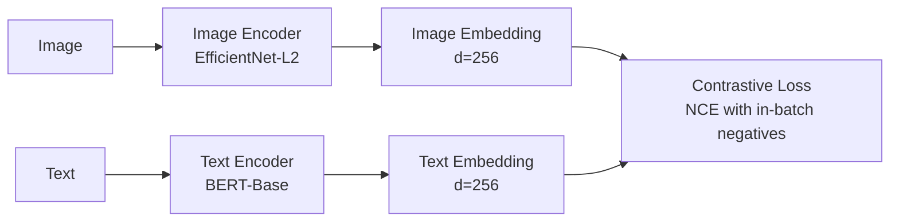

# ALIGN: Large-scale Image and Noisy-Text Embedding（2021）
**论文：** [arXiv](https://arxiv.org/abs/2102.05918) · Chao Jia, Yinfei Yang, Ye Xia, Yi-Ting Chen, Zarana Parekh, Hieu Pham, Quoc V. Le, Yunhsuan Sung, Zhen Li, Tom Duerig · 2021
---

## 一、先搞清楚坑在哪

视觉与语言的多模态学习是近年来的研究热点，核心目标是让模型同时理解图像和文本，建立跨模态的语义桥梁。这类模型的应用场景非常广泛，包括图像检索、文本到图像生成、视觉问答等。

传统的多模态学习方法通常依赖**高质量的人工标注数据**。例如，经典的图像描述（Image Captioning）任务需要人工为每张图片写出准确的描述；视觉问答（VQA）需要人工标注问题和答案。这些数据的获取成本极高，规模有限，通常只有几百万个样本，难以覆盖现实世界中多样化的视觉概念和语言表达。

与此同时，互联网上存在着海量的**图文对数据**——例如网页上的图片及其周围的文字（alt text、标题、正文等）。这些数据虽然数量庞大（可达数十亿级别），但质量参差不齐，文本往往包含噪声、不完整甚至无关的内容。如何有效利用这些噪声数据来学习高质量的视觉-语言表示，是一个关键挑战。

## 二、现有方法的真正问题

在 ALIGN 之前，主流的视觉-语言预训练方法主要分为两类：

1. **基于 Transformer 的双流模型（如 ViLBERT、LXMERT）**：这些方法使用目标检测模型（如 Faster R-CNN）从图像中提取区域特征，然后通过 Transformer 进行跨模态交互。它们的核心问题是：
   - 依赖目标检测模型，计算量大，训练速度慢
   - 目标检测模型本身需要大量标注数据，限制了可扩展性
   - 区域特征丢失了全局上下文信息

2. **基于对比学习的单流模型（如 CLIP）**：CLIP 是 ALIGN 的同期工作，使用 4 亿个图文对进行对比学习。CLIP 的核心思路是将图像和文本分别编码到同一空间，通过对比损失拉近匹配的图文对、推远不匹配的对。但 CLIP 使用的是经过筛选的、质量相对较高的数据集（从互联网收集后经过人工验证）。

ALIGN 的核心观察是：**如果能够直接利用原始、未经筛选的互联网噪声数据，而不需要人工清洗，那么训练数据的规模可以扩展到前所未有的水平**，从而弥补数据质量的不足。

## 三、ALIGN 的核心思路

ALIGN 的核心思路非常直接：**使用 10 亿个从互联网直接爬取的噪声图文对，通过双流对比学习框架，训练一个能够将图像和文本映射到同一语义空间的模型**。

核心假设是：当数据量足够大时，噪声的影响可以被平均掉，模型能够从海量数据中学习到鲁棒的跨模态表示。

简单来说，ALIGN 做的事情就是：拿一张图，用图像编码器得到一个向量；拿对应的文本，用文本编码器得到一个向量。然后让这两个向量的余弦相似度尽可能大，同时让这张图与其他文本的相似度尽可能小。

## 四、方法细节

### 4.1 数据构建

ALIGN 使用的数据集来自互联网，构建方式如下：

1. **图像来源**：从公开的网页数据集中提取图像
2. **文本来源**：使用图像周围的 alt text、标题、正文等作为文本
3. **过滤策略**：基本不做过滤，只移除了一些明显有害的内容（如暴力、色情）
4. **最终规模**：约 10 亿个图文对

这里有个关键点：与 CLIP 使用 4 亿个经过筛选的图文对不同，ALIGN 使用的是 10 亿个**原始、未经筛选**的噪声数据。这体现了 ALIGN 的核心思想——用数量弥补质量。

### 4.2 模型架构

ALIGN 采用双流架构，图像和文本分别使用不同的编码器：

**图像编码器**：EfficientNet-L2
- 输入：图像，resize 到 224×224（或更大尺寸用于微调）
- 输出：图像特征向量，维度 256
- 特点：EfficientNet 是一系列通过神经架构搜索得到的网络，在计算效率和性能之间取得了很好的平衡

**文本编码器**：BERT-Base
- 输入：文本，最大长度 64 个 token
- 输出：文本特征向量，维度 256
- 特点：使用 BERT 的 [CLS] token 的输出作为文本表示

两个编码器的输出都经过一个线性投影层，将特征映射到 256 维的共同空间，然后进行 L2 归一化。

### 4.3 训练目标

ALIGN 使用对比学习中的 NCE（Noise Contrastive Estimation）损失。具体来说，在一个 batch 中，有 N 个图文对，对于每个图像，它的正样本是对应的文本，负样本是 batch 中其他 N-1 个文本。

损失函数定义为：

$$L = -\frac{1}{N} \sum_{i=1}^{N} \log \frac{\exp(s_{ii}/\tau)}{\sum_{j=1}^{N} \exp(s_{ij}/\tau)}$$

其中：
- $s_{ij}$ 是第 i 个图像和第 j 个文本的余弦相似度
- $\tau$ 是温度参数，控制分布的平滑程度
- N 是 batch size

这个损失函数鼓励模型给匹配的图文对更高的相似度分数，给不匹配的图文对更低的分数。

### 4.4 为什么用噪声数据也能有效

乍看之下，使用噪声数据训练似乎会引入大量错误信号。但 ALIGN 的实践证明，当数据量足够大时，这种担心是多余的。原因如下：

1. **统计规律**：虽然单个图文对可能含有噪声（比如 alt text 和图像不完全匹配），但海量数据中的统计规律会强化正确的关联，弱化错误的关联

2. **对比学习的鲁棒性**：对比学习本质上是在做"这个图像和这个文本更相关，比和其他文本更相关"，即使正样本有噪声，只要噪声不是系统性偏差，模型仍然可以学到有用的表示

3. **数据规模效应**：10 亿级别的数据量意味着模型见过的样本足够多，能够覆盖各种视觉概念和语言表达

## 五、公式详解

### 5.1 对比损失公式

$$L = -\frac{1}{N} \sum_{i=1}^{N} \log \frac{\exp(s_{ii}/\tau)}{\sum_{j=1}^{N} \exp(s_{ij}/\tau)}$$

**符号定义**：
- $N$：batch size，ALIGN 使用较大的 batch size（如 16,384）
- $s_{ij}$：第 i 个图像编码器输出 $v_i$ 和第 j 个文本编码器输出 $t_j$ 的余弦相似度，$s_{ij} = \frac{v_i^T t_j}{||v_i|| \cdot ||t_j||}$
- $\tau$：温度参数，控制 softmax 分布的平滑程度，较小的 $\tau$ 会使分布更尖锐

**公式来源**：这个损失函数是 InfoNCE 损失的一种形式，最早由 [Oord et al., 2018] 在 CPC 论文中提出，后来被广泛应用于对比学习。

**直觉理解**：
- 分子部分是第 i 个图像和它对应的文本的相似度（正样本）
- 分母部分是第 i 个图像和 batch 中所有文本的相似度之和（包括正样本和负样本）
- 整个比值是一个 softmax 概率，表示模型认为第 i 个图像应该和第 i 个文本匹配的概率
- 优化目标是最大化这个概率，即让正样本的相似度远大于负样本

**具体例子**：
假设 batch size N=4，温度 $\tau=0.07$，相似度矩阵如下：

| 图像\文本 | t₁ | t₂ | t₃ | t₄ |
|-----------|----|----|----|----|
| v₁        | 0.8 | 0.1 | 0.3 | 0.2 |
| v₂        | 0.2 | 0.7 | 0.1 | 0.4 |
| v₃        | 0.3 | 0.2 | 0.9 | 0.1 |
| v₄        | 0.1 | 0.3 | 0.2 | 0.6 |

对于 i=1（图像 v₁ 和文本 t₁ 是匹配对）：
- 分子：$\exp(0.8/0.07) = \exp(11.43) \approx 91,700$
- 分母：$\exp(0.8/0.07) + \exp(0.1/0.07) + \exp(0.3/0.07) + \exp(0.2/0.07)$
- 分母 ≈ 91,700 + 4.18 + 72.7 + 17.4 = 91,794
- 概率 = 91,700 / 91,794 ≈ 0.999
- 损失 = -log(0.999) ≈ 0.001

这个例子说明，当正样本相似度远大于负样本时，损失很小。

### 5.2 对称损失

ALIGN 还使用对称版本的对比损失，即同时计算图像到文本和文本到图像的损失：

$$L = \frac{1}{2}(L_{i2t} + L_{t2i})$$

其中 $L_{i2t}$ 是图像到文本的损失（上述公式），$L_{t2i}$ 是文本到图像的损失，计算方式类似。

这样做的原因是：图像到文本和文本到图像的匹配难度可能不同，对称损失可以让模型在两个方向上都表现良好。

## 六、实验结果

### 6.1 图像分类（零样本迁移）

ALIGN 在 ImageNet 上的零样本分类结果（使用 prompt engineering）：

| 方法 | 数据集规模 | ImageNet Top-1 |
|------|-----------|----------------|
| CLIP (ViT-L) | 4亿 | 76.2% |
| ALIGN (EfficientNet-L2) | 10亿 | 76.4% |
| ALIGN (EfficientNet-L2, 更大输入) | 10亿 | **78.0%** |

*数据来源：论文 Table 1*

**关键发现**：尽管 ALIGN 使用的是噪声数据，但在 ImageNet 零样本分类上达到了与 CLIP 相当甚至更好的性能。这说明噪声数据经过大规模训练后，确实可以学到高质量的表示。

### 6.2 图像检索

在 Flickr30K 和 MSCOCO 上的图像-文本检索结果：

| 方法 | Flickr30K R@1 (i2t) | Flickr30K R@1 (t2i) | COCO R@1 (i2t) | COCO R@1 (t2i) |
|------|---------------------|---------------------|-----------------|-----------------|
| UNITER | 87.3% | 75.6% | 65.7% | 52.9% |
| OSCAR | 89.8% | 76.4% | 70.0% | 54.0% |
| CLIP (ViT-L) | 88.0% | 76.6% | 65.8% | 53.0% |
| ALIGN | **95.3%** | **84.9%** | **77.0%** | **63.7%** |

*数据来源：论文 Table 2*

**关键发现**：ALIGN 在所有检索指标上都大幅超过之前的 SOTA 方法。在 Flickr30K 上，图像到文本检索的 R@1 达到 95.3%，比之前的 SOTA 高出 5.5 个百分点。这证明了大规模噪声数据训练的模型在下游任务上的强大能力。

### 6.3 视觉定位（Visual Grounding）

在 RefCOCO+ 数据集上的视觉定位结果：

| 方法 | RefCOCO+ testA | RefCOCO+ testB |
|------|---------------|---------------|
| UNITER | 75.9% | 62.9% |
| VILLA | 76.2% | 62.8% |
| ALIGN | **84.5%** | **73.2%** |

*数据来源：论文 Table 3*

**关键发现**：ALIGN 在视觉定位任务上也取得了显著的提升，尤其是在 testB 上（包含更复杂的场景），提升幅度超过 10 个百分点。

### 6.4 数据规模的影响

ALIGN 还研究了不同数据规模下的性能变化：

| 数据规模 | ImageNet Top-1 | Flickr30K R@1 (i2t) |
|----------|---------------|---------------------|
| 30M | 63.2% | 82.1% |
| 200M | 70.3% | 88.5% |
| 1B | 76.4% | 95.3% |

*数据来源：论文 Figure 3*

**关键发现**：随着数据规模从 3000 万增加到 10 亿，模型性能持续提升，没有出现饱和的趋势。这说明更大规模的数据可能带来进一步的性能提升。

## 七、核心创新点分析

### 7.1 大规模噪声数据的使用

**痛点与动机**：高质量标注数据的获取成本极高，限制了模型的规模。之前的工作（如 ViLBERT、UNITER）使用百万级别的标注数据，而互联网上存在海量的噪声图文对。

**方案细节**：直接从互联网爬取 10 亿个图文对，不做人工筛选，仅移除明显有害的内容。

**为什么有效**：海量数据中的统计规律可以克服噪声的影响。实验证明，当数据规模从 3000 万增加到 10 亿时，性能持续提升，说明模型从更多的数据中受益。

**与 Related Work 的关系**：CLIP 也使用了大规模的互联网数据，但 CLIP 的数据经过了一定程度的筛选（如移除低质量文本）。ALIGN 证明了即使不筛选，只要数据量足够大，也能达到相当甚至更好的性能。

**如果去掉会怎样**：如果使用较小规模的数据（如 3000 万），ImageNet 零样本分类准确率会从 76.4% 下降到 63.2%，说明大规模数据是 ALIGN 性能的关键。

### 7.2 双流对比学习框架

**痛点与动机**：之前的双流模型（如 ViLBERT）使用目标检测提取区域特征，计算量大且丢失全局信息。单流模型（如 UNITER）虽然性能好，但需要同时处理图像和文本，计算复杂度高。

**方案细节**：使用 EfficientNet 作为图像编码器，BERT 作为文本编码器，通过对比损失进行训练。

**为什么有效**：双流架构允许图像和文本独立编码，计算效率高。对比学习的目标函数简单有效，能够学习到跨模态的对齐。

**与 Related Work 的关系**：对比学习在视觉领域已经广泛应用（如 SimCLR、MoCo），ALIGN 将其扩展到跨模态场景。EfficientNet 是 Google 的工作，BERT 是 NLP 的标准模型，ALIGN 将两者组合起来。

**如果去掉会怎样**：如果使用单流架构，计算复杂度会大幅增加，无法处理 10 亿级别的数据。如果使用其他损失函数（如三元组损失），训练可能不稳定。

## 八、位置

### 8.1 前驱工作

1. **CLIP [Radford et al., 2021]**：同期工作，使用 4 亿精选图文对进行对比学习。ALIGN 在 CLIP 的基础上探索了更大规模、更噪声的数据。
2. **ViLBERT [Lu et al., 2019]**：使用双流架构和目标检测进行视觉-语言预训练，但数据规模较小。
3. **UNITER [Chen et al., 2020]**：使用单流架构和多任务学习进行预训练，同样受限于数据规模。
4. **SimCLR [Chen et al., 2020]**：视觉领域的对比学习框架，为 ALIGN 的损失函数设计提供了参考。

### 8.2 同期竞品

1. **CLIP [Radford et al., 2021]**：最直接的竞品，使用 4 亿精选数据，性能与 ALIGN 相当。
2. **DeCLIP [Li et al., 2021]**：使用数据增强和自监督信号改进对比学习。
3. **FILIP [Yao et al., 2021]**：使用细粒度对比学习，考虑图像区域和文本片段的匹配。

### 8.3 后续影响

1. **LiT [Zhai et al., 2022]**：Google 的后续工作，在 ALIGN 的基础上冻结图像编码器，只训练文本编码器，进一步提升了性能。
2. **BLIP [Li et al., 2022]**：使用 ALIGN 类似的噪声数据训练，但加入了生成任务和过滤机制，提升了数据质量。
3. **CoCa [Yu et al., 2022]**：将对比学习和生成式目标结合，在 ALIGN 的基础上进一步提升了多模态理解能力。
4. **Florence [Yuan et al., 2021]**：微软的工作，使用更大规模的数据（9 亿图文对）和更大的模型，在多个任务上达到 SOTA。
5. **BEiT-3 [Wang et al., 2022]**：使用掩码图像建模和对比学习，借鉴了 ALIGN 的大规模训练思路。

## 九、局限

### 9.1 数据噪声的不可控性

**局限**：虽然 ALIGN 证明了噪声数据在大规模下有效，但噪声的类型和程度是不可控的。某些类型的噪声（如系统性偏差）可能无法被平均掉。

**影响**：在特定任务上（如公平性、偏见检测），噪声数据可能导致模型学到有害的关联。

**是否被论文承认**：论文中提到了数据噪声的问题，但没有深入分析。

**后续工作**：BLIP 等后续工作尝试通过数据过滤和生成来提升数据质量。

### 9.2 计算资源需求

**局限**：训练 10 亿级别的数据需要大量的计算资源。ALIGN 使用了 1,024 个 TPUv3 核心，训练了约 4 天。

**影响**：这种资源需求使得大多数研究者和中小团队无法复现或改进 ALIGN。

**是否被论文承认**：论文中提到了训练细节，但没有讨论可复现性问题。

### 9.3 零样本迁移的局限性

**局限**：虽然 ALIGN 在零样本迁移上表现不错，但对于细粒度分类（如鸟类、车型）或需要精确理解的场景（如视觉定位中的复杂指令），性能仍然有限。

**影响**：在需要高精度的应用场景中，ALIGN 可能不如专门训练的模型。

**是否被论文承认**：论文在实验部分展示了不同任务上的性能，但没有深入讨论零样本迁移的局限性。

## 十、小结

ALIGN 的核心贡献是证明了**大规模噪声数据可以替代高质量标注数据**用于视觉-语言表示学习。通过使用 10 亿个从互联网直接爬取的噪声图文对，ALIGN 在多个下游任务上达到了 SOTA 性能，与使用精选数据的 CLIP 相当甚至更好。

这篇论文改变了多模态学习领域的研究范式：从追求数据质量转向追求数据规模。后续的许多工作（如 BLIP、CoCa、Florence）都沿用了这一思路，进一步推动了视觉-语言模型的发展。

ALIGN 的实践表明，在深度学习时代，数据规模往往比数据质量更重要。这一发现不仅适用于多模态学习，也可能对其他领域产生深远影响。

---
*Paper reading generated by paper-read skill. Rounds: 1. Accuracy: ✓ Logic: ✓ Readability: ✓ Markdown: ✓*